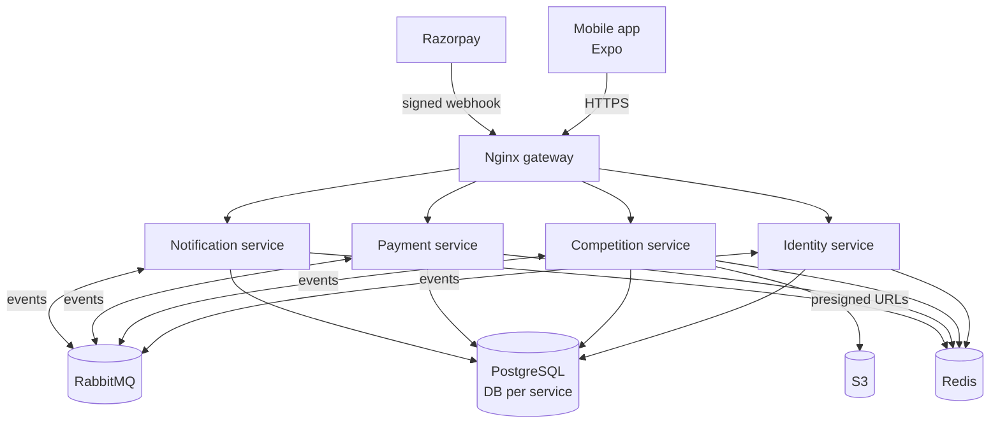

# Feedants

> A two-sided marketplace for creative competitions — hosts launch contests, creators discover, enter, get judged and win.

Mobile app (Expo / React Native) backed by an event-driven set of NestJS microservices, deployed to AWS with Terraform.

**Status:** Phase 0 — Planning. See the [project plan](docs/PROJECT_PLAN.md) for phases, tools and scope.

## Architecture (target)



| Service | Owns |
|---|---|
| **Identity** | Users, profiles, OTP login, JWT (RS256 + JWKS) |
| **Competition** | Competitions, spots & registrations, submissions, judging, leaderboard, search |
| **Payment** | Razorpay orders & webhooks, double-entry wallet ledger, refunds |
| **Notification** | In-app notifications (push & realtime later) |

## Repository structure

```
apps/mobile/            Expo React Native app
services/               NestJS microservices (one folder per service)
packages/shared/        Shared config, logger, errors, event contracts, outbox
infra/                  Docker Compose, Nginx gateway, Terraform (AWS)
docs/                   Plan, requirements, design, ADRs, testing, operations
design/                 Figma prototype, rendered screen references, design tokens (read-only)
.github/                Issue & PR templates, CI workflows
```

## Tech stack

| Layer | Tools |
|---|---|
| Mobile | Expo, Expo Router, TypeScript, NativeWind, TanStack Query, Zustand, zod |
| Backend | Node.js 24, NestJS, Prisma, zod |
| Data & messaging | PostgreSQL, Redis, RabbitMQ, S3 |
| DevOps | Docker, Nginx, Terraform, AWS, GitHub Actions, GHCR |
| Quality | Jest, Testcontainers, Maestro, k6, SonarQube Cloud |
| Security | gitleaks, CodeQL, Trivy, Dependabot, OWASP ZAP |
| Observability | OpenTelemetry, Jaeger, Grafana, Sentry |

## Getting started

Local setup instructions arrive in Phase 2 (Foundation) — see [docs/README.md](docs/README.md) for the documentation map.

## Design

The original Figma prototype and a rendered reference of all 28 screens live in [design/](design/README.md).
