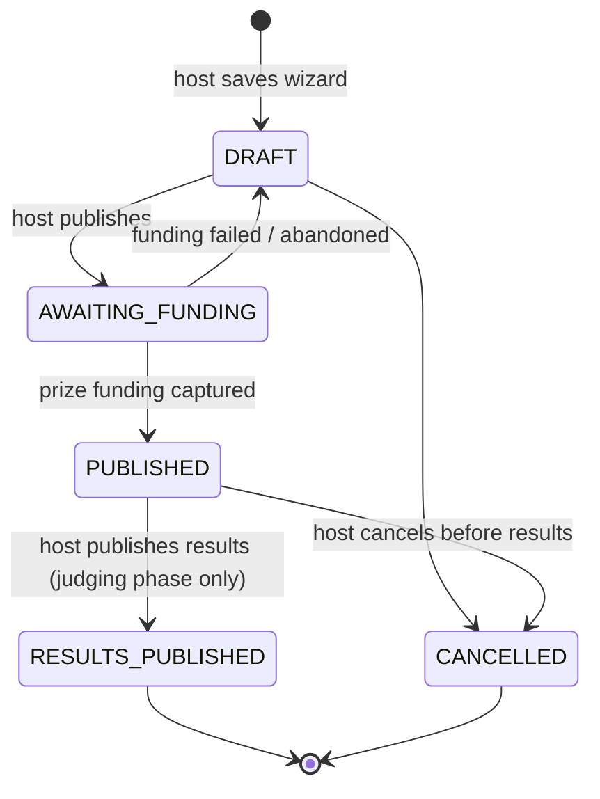

# Software Requirements Specification — Feedants MVP

| | |
|---|---|
| **Version** | 1.0 (Phase 0) |
| **Status** | Draft for review |
| **Related** | [Scope](SCOPE.md) · [User stories](USER_STORIES.md) · [Assumptions](ASSUMPTIONS.md) · [Risks](RISKS.md) · [Project plan](../PROJECT_PLAN.md) |

## 1. Introduction

### 1.1 Purpose

This document defines what the Feedants MVP must do (functional requirements) and how well it must do it (non-functional requirements). It is the baseline for design (Phase 1), test cases (every requirement is testable) and acceptance.

### 1.2 Product scope

Feedants is a two-sided marketplace for creative competitions. **Hosts** create and fund competitions; **creators** discover them, pay an entry fee, submit work and win prizes. The MVP delivers the complete loop — host → discover → join & pay → submit → judge → results → wallet credit — for a single currency (INR), in payment test mode. See [SCOPE.md](SCOPE.md) for what is in, later and out.

### 1.3 Definitions

| Term | Meaning |
|---|---|
| **Guest** | Unauthenticated user; can browse only |
| **Creator** | Authenticated user who joins competitions |
| **Host** | Authenticated user who creates a competition. Any user can be both |
| **Competition** | A contest with a category, prize pool, entry fee, spot limit and time windows |
| **Spot hold** | A temporary reservation of one spot while payment completes; expires after a configured TTL |
| **Registration** | A creator's place in a competition: `HELD → CONFIRMED`, or `HELD → EXPIRED / REJECTED` |
| **Submission** | The creator's entry (media + caption): `DRAFT → SUBMITTED` |
| **Prize tier** | One ranked prize amount (1st, 2nd, …); tiers sum exactly to the prize pool |
| **Escrow** | Ledger account holding a competition's prize pool from publish until results |
| **Ledger** | Append-only, double-entry record of every money movement |
| **Paise** | 1/100 of a rupee; all amounts are stored as integer paise |
| **Phase** | A competition's position in its timeline, derived from its timestamps (see §2.5) |

### 1.4 References

- Product context: [design/prototype/docs/AboutProject.md](../../design/prototype/docs/AboutProject.md) (original FR-1…FR-27, NFR-1…NFR-20)
- Visual reference: [design/reference/](../../design/reference/README.md)
- Architecture and tooling: [PROJECT_PLAN.md](../PROJECT_PLAN.md)

## 2. Overall description

### 2.1 Product perspective

A new system replacing the static prototype. It consists of a mobile app (Android + web export) and four backend services (Identity, Competition, Payment, Notification) behind an Nginx gateway. External systems:

| System | Used for |
|---|---|
| Razorpay (test mode) | Orders, checkout, webhooks, refunds |
| Email provider (Mailpit locally; SES or Resend in production) | OTP delivery |
| S3-compatible object storage (MinIO locally; AWS S3 in production) | Cover images and submission media |

### 2.2 User classes

| Class | Can do |
|---|---|
| Guest | Browse home, explore, search, competition detail, leaderboards, winner profiles, legal pages |
| Creator | Everything a guest can, plus join and pay, submit entries, view own submissions, wallet, notifications, profile |
| Host | Everything a creator can, plus create, fund, publish, edit (until first registration), cancel and judge their own competitions |

There is no admin role in the MVP; reference data (categories) and demo content are loaded by a seed script.

### 2.3 Operating environment

- Mobile: Android 10 (API 29) and above; web export on current Chrome, Edge and Safari (demo only).
- Backend: Linux containers (Docker) on a single AWS EC2 host; PostgreSQL, Redis, RabbitMQ.

### 2.4 Constraints

- **C-1** Payments run in Razorpay **test mode only**; no real money is collected or paid out.
- **C-2** Single currency: INR.
- **C-3** One developer, ~12 weeks part-time, running cost ≈ $15/month.
- **C-4** Public repository: no secrets, keys or personal data in git.
- **C-5** Architecture, stack and tooling are fixed by [PROJECT_PLAN.md](../PROJECT_PLAN.md).

### 2.5 Competition lifecycle

A competition has a stored **status** and, while published, a **phase** derived from its timestamps.

| Phase (status `PUBLISHED`) | Condition | Allowed |
|---|---|---|
| **Upcoming** | now < `registration_opens_at` | View, "Notify me" |
| **Open** | `registration_opens_at` ≤ now < `registration_closes_at` | Join (if spots remain), submit (if submission window open) |
| **Submissions** | `submission_starts_at` ≤ now < `submission_ends_at` | Registered creators submit |
| **Judging** | now ≥ `submission_ends_at` | Host scores and publishes results |

Registration and submission windows may overlap (the design shows submissions opening before registration closes). The host wizard collects a start date and duration; the individual timestamps are derived from them (see [ASSUMPTIONS.md](ASSUMPTIONS.md) A-14).

## 3. Functional requirements

Priority uses MoSCoW: **M** must, **S** should, **C** could. "Source" traces to the prototype's original requirement IDs.

### 3.1 Identity and accounts

| ID | Requirement | Pri | Source |
|---|---|---|---|
| FR-ID-01 | The system shall let a user request a one-time code by email. Codes are 6 digits, expire after a configured TTL (default 5 min), and can be re-sent only after a configured cooldown (default 60 s). | M | FR-1 |
| FR-ID-02 | The system shall verify a code, allowing a configured number of attempts (default 5) before the code is invalidated. Codes are single-use and stored only as hashes. | M | FR-1 |
| FR-ID-03 | On first successful verification the system shall create an account and ask for a display name; later verifications sign in to the existing account. | M | FR-1 |
| FR-ID-04 | The system shall issue a short-lived access token (default 15 min) and a refresh token (default 30 days). Each refresh returns a new refresh token; reuse of an already-rotated refresh token shall revoke all tokens in that family. | M | — |
| FR-ID-05 | A user shall be able to sign out, revoking the refresh token for the current device. | M | — |
| FR-ID-06 | A user shall be able to view and edit their display name, avatar and bio. | M | FR-2 |
| FR-ID-07 | A public profile shall show display name, avatar, competitions joined, competitions won and total winnings. | S | FR-2, FR-3 |
| FR-ID-08 | A guest attempting an authenticated action shall be sent to sign-in and returned to the original screen afterwards. | M | — |
| FR-ID-09 | A user shall be able to request account deletion; personal data is removed or anonymised, while ledger records are retained with an anonymised owner. | S | — |

### 3.2 Discovery

| ID | Requirement | Pri | Source |
|---|---|---|---|
| FR-DS-01 | Home shall show: featured competition, categories, trending, upcoming, ending soon, top prize and recent winners sections. Section rules are defined in [ASSUMPTIONS.md](ASSUMPTIONS.md) A-18. | M | FR-4 |
| FR-DS-02 | Home shall show the signed-in user's stats: joined, won, and a finish-your-submission shortcut when a draft exists. | S | FR-3, FR-12 |
| FR-DS-03 | Explore shall list published competitions filterable by category and phase, sortable by popularity, prize pool and closing time, with cursor pagination. | M | FR-6 |
| FR-DS-04 | Search shall match competition title, category and host name, tolerate minor typos, require at least 2 characters, and return paginated results. Recent searches are stored on the device only. | M | FR-5 |
| FR-DS-05 | Competition detail shall show title, cover, category, host, description, prize pool and tiers, entry fee and fee breakdown, spots remaining, participants, all key dates, a live countdown, and the viewer's registration status. | M | FR-7 |
| FR-DS-06 | Unknown or unpublished competition IDs shall return "not found"; drafts are visible only to their host. | M | NFR-11 |
| FR-DS-07 | A user shall be able to turn "Notify me" on or off for an upcoming competition. | S | FR-14 |
| FR-DS-08 | The system shall show top hosts (competitions run, participants, completed count) and recent winners with links to winner profiles. | S | FR-8 |

### 3.3 Hosting

| ID | Requirement | Pri | Source |
|---|---|---|---|
| FR-HS-01 | A host shall create a competition through a four-step wizard — Basics, Prize, Schedule, Review — that blocks progress until the current step is valid. | M | FR-16, FR-20 |
| FR-HS-02 | Basics: title (5–80 chars), category (from the category list), optional description (≤ 2,000 chars), optional cover image (JPEG/PNG/WebP, ≤ configured size). | M | FR-17 |
| FR-HS-03 | Prize: prize pool with presets (₹2,500 / ₹5,000 / ₹10,000 / ₹25,000) or custom within configured min/max; entry fee of ₹0 or within configured min/max; show the resulting prize tiers. | M | FR-18 |
| FR-HS-04 | Schedule: start date/time at least a configured lead time in the future; duration from configured options (3 days, 1 week, 2 weeks, 1 month); max spots within configured bounds (default 2–10,000). | M | FR-19 |
| FR-HS-05 | A host shall be able to save a draft and resume it later. | M | — |
| FR-HS-06 | Publishing shall require the prize pool to be funded through the payment flow (test mode). The competition becomes publicly visible only after funding is captured. | M | FR-22 |
| FR-HS-07 | After publishing, the host shall see a confirmation with prize, spots and duration, and options to go to their dashboard or host another. | M | FR-21 |
| FR-HS-08 | A host shall be able to edit a published competition's details only until its first registration exists. | M | NFR-14 |
| FR-HS-09 | A host shall be able to cancel a competition before results are published; all confirmed registrations are refunded and the escrowed prize pool is returned to the host's wallet. | M | — |
| FR-HS-10 | "My competitions" shall list the host's competitions with status/phase, registrations, submissions and entry-fee revenue. | M | FR-23 |

### 3.4 Participation

| ID | Requirement | Pri | Source |
|---|---|---|---|
| FR-PT-01 | A creator shall be able to join a competition only if: signed in, phase is Open, a spot is available, they have no active registration for it, and they are not its host. | M | FR-10 |
| FR-PT-02 | Joining shall atomically reserve one spot as a hold that expires after a configured TTL (default 10 min). Two creators can never hold or confirm the same last spot. | M | NFR-10 |
| FR-PT-03 | For a free competition the registration shall be confirmed immediately without payment. | M | — |
| FR-PT-04 | For a paid competition the server shall create a payment order whose amount (entry fee + platform fee) it computes itself. The app opens checkout; the registration is confirmed only after the payment service receives a verified payment-captured webhook. | M | FR-10, FR-22 |
| FR-PT-05 | The join sheet shall show prize pool, spots left, time remaining and the fee breakdown, then progress visibly through form → processing → confirmed ("You're in!") or a failure state with a retry option. | M | FR-11 |
| FR-PT-06 | If a hold expires or payment fails, the spot shall be released. If payment is captured after the hold expired and no spot remains, the registration shall be rejected and the payment refunded in full automatically. | M | NFR-10 |
| FR-PT-07 | Repeating a join request with the same idempotency key shall return the original result and never create a second charge or registration. | M | NFR-10 |

### 3.5 Submissions

| ID | Requirement | Pri | Source |
|---|---|---|---|
| FR-SB-01 | A confirmed creator shall upload media directly to object storage using a short-lived upload URL restricted by content type and size. | M | FR-12 |
| FR-SB-02 | Accepted media: image (JPEG/PNG/WebP), video (MP4), audio (MP3/M4A), each within configured size limits. | M | — |
| FR-SB-03 | A submission shall be saved as a draft automatically and resumable later, with a checklist showing completion percentage. | M | FR-12, FR-13, NFR-8 |
| FR-SB-04 | Final submission shall be allowed only in the submissions phase, only when the checklist is complete, and only once per registration. A submitted entry cannot be changed. | M | FR-13 |
| FR-SB-05 | "My submissions" shall list the creator's entries with status: Draft, In review, Won, Not selected, filterable by status. | M | — |

### 3.6 Judging and results

| ID | Requirement | Pri | Source |
|---|---|---|---|
| FR-JG-01 | In the judging phase the host shall view all submissions for their competition. | M | FR-23 |
| FR-JG-02 | The host shall score each submission on a configured scale (default 0–10, one decimal) with an optional comment. | M | FR-23 |
| FR-JG-03 | The host shall be able to publish results only when every submission is scored. Ranking is by score, ties broken by earlier submission time. Results are immutable once published. | M | FR-23, FR-24 |
| FR-JG-04 | If there are fewer submissions than prize tiers, unawarded tier amounts shall be returned to the host's wallet. | M | — |
| FR-JG-05 | A public leaderboard shall show ranked participants, scores and prizes after results are published. | M | FR-24 |
| FR-JG-06 | A winner profile shall show the winner's wins, placements and prize amounts. | S | FR-8, FR-24 |

### 3.7 Payments and wallet

| ID | Requirement | Pri | Source |
|---|---|---|---|
| FR-PY-01 | Every payment order shall carry a purpose (entry fee or prize funding), a reference, a server-computed amount and a unique idempotency key. | M | FR-22 |
| FR-PY-02 | Webhooks shall be accepted only with a valid signature over the raw body, stored as received, and processed idempotently by event ID, tolerating duplicates and out-of-order delivery. | M | NFR-12 |
| FR-PY-03 | Every money movement shall be recorded as a balanced double-entry ledger transaction. Entries are never updated or deleted; balances are derived from entries. | M | NFR-10 |
| FR-PY-04 | Prize funding shall credit the competition's escrow account. Entry fees shall credit the platform (platform fee) and host revenue accounts according to configuration. | M | — |
| FR-PY-05 | On results publication, escrow shall be paid to winners' wallets according to the prize tiers. | M | FR-23 |
| FR-PY-06 | Refunds (rejected registration, cancellation) shall be issued automatically through Razorpay and recorded in the ledger. | M | NFR-10 |
| FR-PY-07 | The wallet shall show available balance, total winnings, and transaction history filterable by All / Earnings / Entries / Refunds. | M | — |
| FR-PY-08 | A daily reconciliation job shall compare captured payments with ledger entries and report mismatches. | C | — |

### 3.8 Notifications

| ID | Requirement | Pri | Source |
|---|---|---|---|
| FR-NT-01 | The system shall create in-app notifications for: registration confirmed, payment failed, refund issued, competition published (host), upcoming competition opened (users with "Notify me"), results published (participants), and prize won. | M | FR-25 |
| FR-NT-02 | Notifications shall be listed newest first with pagination, an unread count on Home, and mark-one / mark-all-read actions. | M | FR-25, FR-27 |
| FR-NT-03 | Tapping a notification shall open the related screen. | M | — |

### 3.9 Deferred from the prototype

FR-9 (live push-style banner) and FR-26 (Live activity surface) are **Later**; chat, referral, withdrawals and Settings beyond sign-out/deletion are **Later**. See [SCOPE.md](SCOPE.md).

## 4. Non-functional requirements

Every NFR has a measurable target and a verification method.

### 4.1 Performance

| ID | Requirement | Verified by |
|---|---|---|
| NFR-PF-01 | API reads: p95 < 200 ms; writes: p95 < 400 ms, at a sustained 100 requests/s mixed load (90 % reads) on the production host | k6 load test report |
| NFR-PF-02 | Error rate < 0.1 % under the NFR-PF-01 load | k6 |
| NFR-PF-03 | List endpoints use cursor pagination; page N costs the same as page 1 | Query plan review, k6 |
| NFR-PF-04 | App cold start < 2 s and 60 fps list scrolling on a mid-range Android device | Manual profiling |
| NFR-PF-05 | Uploads go directly to object storage; media is compressed on the device before upload | Design review |

### 4.2 Reliability and data integrity

| ID | Requirement | Verified by |
|---|---|---|
| NFR-RL-01 | No overbooking: 50 concurrent join attempts for 1 remaining spot result in exactly 1 confirmed registration | Concurrency integration test |
| NFR-RL-02 | No double charge: duplicate join requests and duplicate webhooks produce one charge and one registration | Integration tests |
| NFR-RL-03 | No lost events: every state change that publishes an event does so through a transactional outbox; consumers are idempotent | Tests that kill a service mid-flow |
| NFR-RL-04 | Notification-service downtime does not block join, pay or submit; queued events are delivered on recovery | Resilience test |
| NFR-RL-05 | Ledger invariant: every ledger transaction sums to zero | DB constraint/test and reconciliation |
| NFR-RL-06 | Availability ≥ 99.5 % per month while the environment is running | Uptime monitor |
| NFR-RL-07 | Backups: RPO ≤ 24 h, RTO ≤ 1 h, proven by a restore drill | Restore drill record |

### 4.3 Security and privacy

| ID | Requirement | Verified by |
|---|---|---|
| NFR-SC-01 | All traffic over TLS; only the gateway is reachable from the internet; SSH closed | Terraform review, port scan |
| NFR-SC-02 | Every endpoint enforces authentication where required and ownership checks on resources (no cross-user access) | Authorisation test per endpoint |
| NFR-SC-03 | Rate limits on OTP request/verify and on all public endpoints | Integration test |
| NFR-SC-04 | All input validated against schemas; unknown fields rejected | Tests, code review |
| NFR-SC-05 | No secrets in the repository or images; production secrets in SSM Parameter Store | gitleaks, Trivy |
| NFR-SC-06 | No card data handled by the system (checkout is Razorpay-hosted) | Design review |
| NFR-SC-07 | Personal data limited to email, display name, avatar and bio; PII redacted from logs; deletion supported (India DPDP Act 2023 awareness) | Log review, FR-ID-09 test |
| NFR-SC-08 | No high or critical findings from CodeQL, Trivy or OWASP ZAP at release | CI reports |

### 4.4 Usability and accessibility

| ID | Requirement | Verified by |
|---|---|---|
| NFR-UX-01 | Screens match the design reference in layout, color and copy | Visual comparison with `design/reference` |
| NFR-UX-02 | Every async action shows immediate feedback and a clear success or error state; the UI never blocks silently | E2E tests |
| NFR-UX-03 | Text contrast ≥ 4.5:1 (3:1 for large text); touch targets ≥ 44×44 pt; state is not signalled by color alone | Accessibility check |
| NFR-UX-04 | All interactive elements have accessible labels; images have descriptions | Screen-reader pass |
| NFR-UX-05 | Layout holds at 200 % system font size | Manual check |
| NFR-UX-06 | All user-facing strings externalised for translation (English in MVP) | Lint rule |
| NFR-UX-07 | The app works with cached data and shows an offline banner when the network is lost; drafts are never lost | E2E test |

### 4.5 Maintainability and operability

| ID | Requirement | Verified by |
|---|---|---|
| NFR-MT-01 | Each service is independently buildable, testable and deployable | CI |
| NFR-MT-02 | ≥ 80 % line coverage on domain logic (money, lifecycle, prize split, ledger) | Coverage report |
| NFR-MT-03 | No hard-coded configuration or secrets; config validated at startup | Lint, startup tests |
| NFR-MT-04 | Every request carries a request ID and trace context across HTTP and message boundaries | Trace inspection |
| NFR-MT-05 | Health endpoints (liveness, readiness) on every service | CI smoke test |
| NFR-MT-06 | Alerts on 5xx rate > 1 % over 5 min, dead-letter queue depth > 0, and host resource exhaustion | Alert test |
| NFR-MT-07 | Every architectural decision recorded as an ADR | Review |

### 4.6 Scalability

| ID | Requirement | Verified by |
|---|---|---|
| NFR-SL-01 | Services keep no user state in memory, so any service can run as multiple instances | Run two instances behind the gateway in a test |
| NFR-SL-02 | Each service owns its data; no service reads another service's database | DB user permissions |
| NFR-SL-03 | Scaling steps in the project plan require configuration or infrastructure changes only | Design review |

## 5. External interface requirements

| Interface | Requirement |
|---|---|
| **Razorpay** | Orders API to create orders; hosted Checkout in the app; webhooks for payment captured/failed and refund processed; Refunds API. Test-mode keys only. |
| **Email** | Transactional send of OTP messages with a plain-text fallback. |
| **Object storage** | Presigned PUT (upload) and GET (read) URLs; private bucket; lifecycle rule for abandoned uploads. |
| **Mobile ↔ API** | JSON over HTTPS; versioned under `/v1`; errors in one standard format with a request ID; OpenAPI published per service. |

## 6. Traceability

Original prototype requirements → this SRS:

| Original | Here | Original | Here |
|---|---|---|---|
| FR-1 | FR-ID-01…03 | FR-15 | FR-HS-01 (entry from Home) |
| FR-2, FR-3 | FR-ID-06, FR-ID-07, FR-DS-02 | FR-16…FR-21 | FR-HS-01…07 |
| FR-4 | FR-DS-01 | FR-22 | FR-PT-04, FR-HS-06, FR-PY-01 |
| FR-5, FR-6 | FR-DS-04, FR-DS-03 | FR-23 | FR-HS-10, FR-JG-01…03, FR-PY-05 |
| FR-7 | FR-DS-05 | FR-24 | FR-JG-03, FR-JG-05, FR-JG-06 |
| FR-8 | FR-DS-08, FR-JG-06 | FR-25, FR-27 | FR-NT-01, FR-NT-02 |
| FR-9, FR-26 | Later | NFR-1…20 | §4 (made measurable) |
| FR-10, FR-11 | FR-PT-01…05 | | |
| FR-12, FR-13 | FR-SB-03, FR-SB-04 | | |
| FR-14 | FR-DS-07 | | |

Requirements → user stories: see the "Covers" column in [USER_STORIES.md](USER_STORIES.md).
