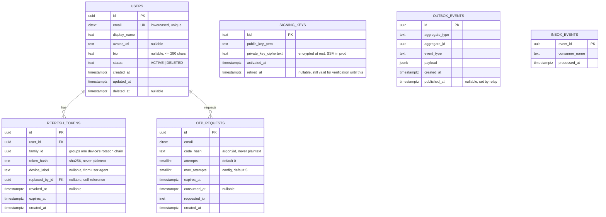
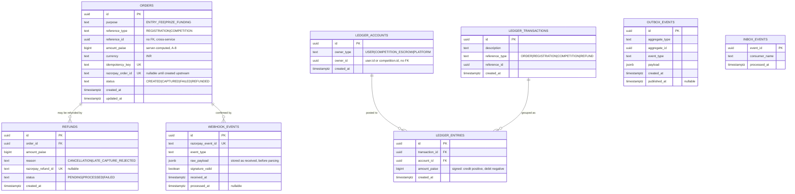
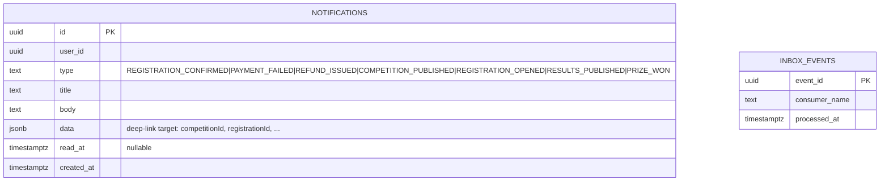

# Data Model (ERD)

| | |
|---|---|
| **Version** | 1.0 (Phase 1) |
| **Status** | Draft for review |
| **Related** | [SRS](../01-requirements/SRS.md) · [Assumptions](../01-requirements/ASSUMPTIONS.md) · [HLD](HLD.md) · [Events](EVENTS.md) · [API](API.md) |

## 1. Principles

- **One database per service** (NFR-SL-02): `identity_db`, `competition_db`, `payment_db`, `notification_db`, each with its own least-privilege DB user. No foreign keys cross a database boundary — a service that needs another service's fact stores its own **read-optimised copy**, kept current by consuming that owner's events (PROJECT_PLAN "local copies" pattern).
- **Money is integer paise** (`BIGINT`), never float (A-6). Amounts are formatted only at display time.
- **Time is UTC** (`TIMESTAMPTZ`), always (A-15).
- **IDs are UUIDv7** (time-ordered, index-friendly) generated by the application, so an entity's ID is known before insert (needed for idempotency keys and outbox payloads).
- **Every service carries the same two plumbing tables**, part of the mandatory consistency patterns in [PROJECT_PLAN.md](../PROJECT_PLAN.md):
  - `outbox_events` — an event is written to this table in the *same transaction* as the business change, then relayed to RabbitMQ by a poller/publisher.
  - `inbox_events` — every consumed event's ID is recorded here inside the *same transaction* as the side effect it causes, so a redelivered event is a no-op (idempotent consumer, NFR-RL-03).
- Soft-delete only where required for retention (`users`, via `status = DELETED` — FR-ID-09); everything else is hard rows with immutable history (ledger, outbox).

## 2. Identity service — `identity_db`



**Constraints and indexes**

| Table | Constraint |
|---|---|
| `users` | `UNIQUE(email)`; partial index `WHERE status = 'ACTIVE'` for lookups |
| `otp_requests` | index `(email, created_at DESC)`; TTL cleanup job removes rows `expires_at < now() - 1 day` |
| `refresh_tokens` | index `(family_id)` for reuse-detection revocation sweep; index `(user_id, revoked_at)` |
| `signing_keys` | at most one row with `retired_at IS NULL` per active key; rotation inserts a new row and sets `retired_at` on the old one after a grace window |
| `outbox_events` | index `(published_at) WHERE published_at IS NULL` (relay poll queue) |

## 3. Competition service — `competition_db`

```mermaid
erDiagram
  CATEGORIES ||--o{ COMPETITIONS : "classifies"
  COMPETITIONS ||--o{ PRIZE_TIERS : "pays out"
  COMPETITIONS ||--o{ REGISTRATIONS : "has"
  COMPETITIONS ||--o{ NOTIFY_SUBSCRIPTIONS : "watched by"
  REGISTRATIONS ||--o| SUBMISSIONS : "produces"

  CATEGORIES {
    smallint id PK
    text slug UK
    text name
    text icon
  }

  COMPETITIONS {
    uuid id PK
    uuid host_id "identity.users.id, no FK"
    text host_display_name_cache "kept current via user.updated"
    text host_avatar_url_cache "nullable"
    text title
    text slug UK
    smallint category_id FK
    text description "nullable"
    text cover_image_url "nullable"
    text status "DRAFT|AWAITING_FUNDING|PUBLISHED|RESULTS_PUBLISHED|CANCELLED"
    bigint prize_pool_paise
    bigint entry_fee_paise "0 = free"
    bigint platform_fee_paise "computed at publish, A-8"
    int max_spots
    int spots_remaining
    boolean featured "seed override, A-18"
    timestamptz start_at
    timestamptz registration_opens_at
    timestamptz registration_closes_at
    timestamptz submission_starts_at
    timestamptz submission_ends_at
    timestamptz results_due_at
    timestamptz results_published_at "nullable"
    timestamptz published_at "nullable"
    timestamptz cancelled_at "nullable"
    timestamptz registration_opened_notified_at "nullable, sweep sets once"
    int version "optimistic lock for edit-lock check"
    timestamptz created_at
    timestamptz updated_at
  }

  PRIZE_TIERS {
    uuid id PK
    uuid competition_id FK
    smallint rank "1 = first place"
    bigint amount_paise
  }

  REGISTRATIONS {
    uuid id PK
    uuid competition_id FK
    uuid creator_id "identity.users.id, no FK"
    text status "HELD|CONFIRMED|EXPIRED|REJECTED|REFUNDED"
    text idempotency_key UK
    uuid payment_order_id "nullable, payment.orders.id, no FK"
    timestamptz hold_expires_at "nullable once CONFIRMED"
    timestamptz confirmed_at "nullable"
    timestamptz created_at
    timestamptz updated_at
  }

  SUBMISSIONS {
    uuid id PK
    uuid registration_id "FK, UK" "one submission per registration, A-25"
    uuid competition_id FK
    uuid creator_id
    text media_url "nullable until uploaded"
    text media_type "IMAGE|VIDEO|AUDIO"
    text caption "nullable"
    boolean rules_accepted "default false"
    text status "DRAFT|SUBMITTED"
    numeric score "nullable, 0.0-10.0, one decimal"
    text score_comment "nullable"
    timestamptz submitted_at "nullable"
    timestamptz scored_at "nullable"
    timestamptz created_at
    timestamptz updated_at
  }

  NOTIFY_SUBSCRIPTIONS {
    uuid id PK
    uuid competition_id FK
    uuid user_id
    timestamptz created_at
  }

  OUTBOX_EVENTS {
    uuid id PK
    text aggregate_type
    uuid aggregate_id
    text event_type
    jsonb payload
    timestamptz created_at
    timestamptz published_at "nullable"
  }

  INBOX_EVENTS {
    uuid event_id PK
    text consumer_name
    timestamptz processed_at
  }
```

**Constraints and indexes**

| Table | Constraint |
|---|---|
| `competitions` | `spots_remaining >= 0` check; index `(status, registration_opens_at)` for Home/Explore; GIN trigram index on `title` and `host_display_name_cache` for search (A-19); partial index `(category_id) WHERE status = 'PUBLISHED'` |
| `prize_tiers` | `UNIQUE(competition_id, rank)`; app-level invariant `SUM(amount_paise) = competitions.prize_pool_paise`, checked in the same transaction that inserts them |
| `registrations` | partial unique index `(competition_id, creator_id) WHERE status IN ('HELD','CONFIRMED')` — enforces one active registration per creator per competition (A-21); index `(hold_expires_at) WHERE status = 'HELD'` for the expiry sweep |
| `submissions` | `UNIQUE(registration_id)`; once `status = 'SUBMITTED'` the row is immutable at the application layer (no UPDATE path) |
| `notify_subscriptions` | `UNIQUE(competition_id, user_id)` |

**The concurrency-critical write** (NFR-RL-01, no overbooking on the last spot): joining a competition is a single transaction —

```sql
UPDATE competitions
   SET spots_remaining = spots_remaining - 1
 WHERE id = $1 AND spots_remaining > 0;
-- 0 rows affected => no spots left, abort with 409
INSERT INTO registrations (..., status) VALUES (..., 'HELD');
INSERT INTO outbox_events (...) VALUES (..., 'registration.held', ...);
```

Postgres row-level locking on the `UPDATE` serialises concurrent joins for the same competition; the conditional `WHERE` makes "spot taken" atomic with "hold created" — see [LLD/competition.md](LLD/competition.md#joining) for the full flow including the hold-expiry sweep.

## 4. Payment service — `payment_db`



**Constraints and indexes**

| Table | Constraint |
|---|---|
| `orders` | `UNIQUE(idempotency_key)` — a repeated join or publish request returns the existing order instead of creating a second one (FR-PT-07); index `(reference_type, reference_id)` |
| `webhook_events` | `UNIQUE(razorpay_event_id)` — the idempotency boundary for NFR-RL-02; unsigned payloads are stored with `signature_valid = false` and never processed |
| `ledger_accounts` | `UNIQUE(owner_type, owner_id)` — one account per user, one escrow account per competition, one singleton platform account |
| `ledger_entries` | **invariant** (FR-PY-03, NFR-RL-05): `SUM(amount_paise) OVER (PARTITION BY transaction_id) = 0`, enforced by an `AFTER INSERT` constraint trigger deferred to transaction commit, and re-checked by the daily reconciliation job (FR-PY-08) |
| `ledger_entries` | index `(account_id, created_at)` — wallet balance and history are `SUM()` / paginated `SELECT` over this index, never a stored balance column |

**Wallet balance** (FR-PY-07) is always derived, never stored: `SELECT COALESCE(SUM(amount_paise), 0) FROM ledger_entries e JOIN ledger_accounts a ON a.id = e.account_id WHERE a.owner_type = 'USER' AND a.owner_id = :userId`. This keeps US-30's invariant ("the balance always equals the sum of my ledger entries") true by construction.

## 5. Notification service — `notification_db`



**Constraints and indexes**

| Table | Constraint |
|---|---|
| `notifications` | index `(user_id, created_at DESC)` for the paginated list; partial index `(user_id) WHERE read_at IS NULL` for the unread-count badge |

Notification is a pure event consumer (no `outbox_events` — it never originates domain events, only reads and stores them; PROJECT_PLAN's "its outage never blocks the core loop").

## 6. Cross-service data flow (no cross-database joins)

| Consumer needs | From | Kept current by |
|---|---|---|
| Competition's `host_display_name_cache` / `host_avatar_url_cache` | Identity | consuming `user.updated`, filtered on `host_id = event.userId` (US-05) |
| Payment's order `reference_id` → competition/registration facts | Competition | Payment never reads them back; Competition supplies everything needed (amount, purpose) when it calls Payment synchronously to create the order |
| Competition confirming a registration | Payment | consuming `payment.captured` / `payment.failed`, matched by `orders.idempotency_key` == `registrations.idempotency_key` |
| Notification's message content | Identity, Competition, Payment | each event payload is self-contained (denormalised) — Notification never calls another service to enrich a message |

No service ever queries another service's database directly, satisfying NFR-SL-02. See [EVENTS.md](EVENTS.md) for the full event catalog and [HLD.md](HLD.md#5-consistency-patterns) for how the outbox/inbox pair guarantees delivery.
