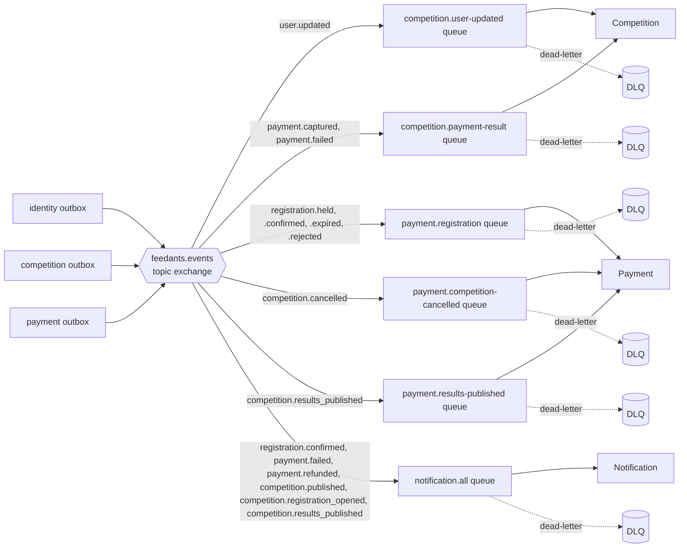

# Event Catalog (AsyncAPI-lite)

| | |
|---|---|
| **Version** | 1.0 (Phase 1) |
| **Status** | Draft for review |
| **Related** | [HLD](HLD.md#5-consistency-patterns) · [ERD](ERD.md) · [API](API.md) |

A full `asyncapi.yaml` is generated from the NestJS event definitions in Phase 2/3 (per `docs/README.md`); this is the human-readable contract that design review works from now. All events share one **envelope**, are published to a single **topic exchange** (`feedants.events`), and are routed by `event_type` as the routing key.

## 1. Envelope

```json
{
  "id": "uuid — the event's own ID, used for inbox dedupe",
  "type": "competition.published",
  "occurredAt": "2026-09-28T10:15:00Z",
  "producer": "competition",
  "traceId": "uuid — propagated from the originating HTTP request (NFR-MT-04)",
  "data": { "...": "event-specific payload, self-contained (no callback needed to read it)" }
}
```

Every consumer records `id` in its `inbox_events` table before acting (§5.2 of [HLD.md](HLD.md)); redelivery is a guaranteed possibility (at-least-once), never treated as exceptional.

## 2. Exchange and queue topology



One durable queue per `(consumer service, concern)` pair, each with its own dead-letter queue (PROJECT_PLAN: "dead-letter queue per consumer with an inspect-and-replay script"). A message that fails processing after retries is dead-lettered rather than blocking the queue.

## 3. Events published by Identity

### `user.created`

| | |
|---|---|
| Consumers | none in MVP (reserved for later welcome-notification use) |
| Emitted when | First successful OTP verification creates the account (FR-ID-03) |

```json
{ "userId": "uuid", "email": "string", "createdAt": "timestamp" }
```

### `user.updated`

| | |
|---|---|
| Consumers | Competition (`competition.user-updated`) |
| Emitted when | Display name, avatar or bio changes (FR-ID-06) |

```json
{ "userId": "uuid", "displayName": "string", "avatarUrl": "string|null" }
```

Competition's consumer updates `host_display_name_cache` / `host_avatar_url_cache` on every `competitions` row where `host_id = userId` (US-05: "appears on competitions I host within a few seconds").

### `user.deleted`

| | |
|---|---|
| Consumers | none in MVP; Competition and Payment retain `host_id`/`creator_id`/`owner_id` values as opaque anonymised UUIDs (ledger and competition history are retained per FR-ID-09) |
| Emitted when | Account deletion completes |

```json
{ "userId": "uuid" }
```

## 4. Events published by Competition

### `registration.held`

| | |
|---|---|
| Consumers | none directly (informational / audit trail; Payment learns about the order via the synchronous call, not this event) |
| Emitted when | A spot hold is created (FR-PT-02) |

```json
{ "registrationId": "uuid", "competitionId": "uuid", "creatorId": "uuid", "holdExpiresAt": "timestamp" }
```

### `registration.confirmed`

| | |
|---|---|
| Consumers | Notification |
| Emitted when | Free join completes, or `payment.captured` arrives for a still-valid hold |

```json
{ "registrationId": "uuid", "competitionId": "uuid", "competitionTitle": "string", "creatorId": "uuid" }
```

### `registration.expired`

| | |
|---|---|
| Consumers | none (spot release is internal to Competition; no other service needs to know) |
| Emitted when | The hold-expiry sweep releases an unconfirmed hold |

```json
{ "registrationId": "uuid", "competitionId": "uuid" }
```

### `registration.rejected`

| | |
|---|---|
| Consumers | Payment (`payment.registration`) |
| Emitted when | `payment.captured` arrives for a hold that is no longer `HELD` (expired or the spot was retaken) — the late-capture case (FR-PT-06, US-22) |

```json
{ "registrationId": "uuid", "competitionId": "uuid", "creatorId": "uuid", "orderId": "uuid" }
```

Payment's consumer issues a full refund against `orderId` and posts the reversing ledger entries.

### `competition.published`

| | |
|---|---|
| Consumers | Notification |
| Emitted when | Prize funding is captured and the competition becomes public (FR-HS-06) |

```json
{ "competitionId": "uuid", "hostId": "uuid", "title": "string" }
```

### `competition.registration_opened`

| | |
|---|---|
| Consumers | Notification |
| Emitted when | A scheduled sweep detects `now() >= registration_opens_at` for a competition with at least one row in `notify_subscriptions`, and sets `registration_opened_notified_at` (once-only guard) |

```json
{ "competitionId": "uuid", "title": "string", "subscriberUserIds": ["uuid", "..."] }
```

### `competition.cancelled`

| | |
|---|---|
| Consumers | Payment (refunds + escrow return), Notification |
| Emitted when | A host cancels before results are published (FR-HS-09) |

```json
{
  "competitionId": "uuid",
  "hostId": "uuid",
  "title": "string",
  "confirmedRegistrations": [
    { "registrationId": "uuid", "creatorId": "uuid", "orderId": "uuid" }
  ]
}
```

Payment's consumer, per array entry, refunds the entry-fee order in full, then in the same logical unit of work returns the competition's remaining escrow balance to the host's wallet (one ledger transaction per registration refund, one for the escrow return — each idempotent by `(eventId, ledger transaction reference)`).

### `competition.results_published`

| | |
|---|---|
| Consumers | Payment (payout postings), Notification (results + "prize won") |
| Emitted when | The host publishes results after every submission is scored (FR-JG-03…05) |

```json
{
  "competitionId": "uuid",
  "hostId": "uuid",
  "title": "string",
  "winners": [
    { "rank": 1, "registrationId": "uuid", "creatorId": "uuid", "amountPaise": 150000 }
  ],
  "unawardedAmountPaise": 0,
  "hostRevenuePaise": 45000,
  "allRegistrationCreatorIds": ["uuid", "..."]
}
```

Payment's consumer posts, in one ledger transaction per competition: debit escrow / credit each winner's wallet (per `winners[]`), debit escrow / credit host wallet for `unawardedAmountPaise` (A-29) and `hostRevenuePaise` (A-10). Notification's consumer sends "results published" to everyone in `allRegistrationCreatorIds`, and additionally "you won 🏆" to everyone in `winners[]`.

### `submission.submitted`

| | |
|---|---|
| Consumers | none in MVP (reserved for a future moderation/search consumer) |
| Emitted when | A creator finalises a submission (FR-SB-04) |

```json
{ "submissionId": "uuid", "competitionId": "uuid", "creatorId": "uuid" }
```

## 5. Events published by Payment

### `payment.captured`

| | |
|---|---|
| Consumers | Competition (`competition.payment-result`) |
| Emitted when | A verified `payment.captured` webhook is processed for an `ENTRY_FEE` order |

```json
{ "orderId": "uuid", "idempotencyKey": "string", "amountPaise": 10900, "purpose": "ENTRY_FEE" }
```

Competition matches `idempotencyKey` back to a `registrations` row to confirm or reject it (§5.4 of HLD.md). `PRIZE_FUNDING` captures are handled the same way but drive the Wizard/Publish service instead.

### `payment.failed`

| | |
|---|---|
| Consumers | Competition, Notification |
| Emitted when | A verified `payment.failed` webhook is processed |

```json
{ "orderId": "uuid", "idempotencyKey": "string", "reason": "string" }
```

### `payment.refunded`

| | |
|---|---|
| Consumers | Notification |
| Emitted when | A refund (cancellation, late-capture rejection) is processed by Razorpay |

```json
{ "refundId": "uuid", "orderId": "uuid", "creatorId": "uuid", "amountPaise": 10900, "reason": "CANCELLATION|LATE_CAPTURE_REJECTED" }
```

## 6. Notification service

Publishes nothing (§5 of [ERD.md](ERD.md) — pure consumer). Consumes: `registration.confirmed`, `payment.failed`, `payment.refunded`, `competition.published`, `competition.registration_opened`, `competition.cancelled`, `competition.results_published` — one queue, one handler dispatching on `type` to build the right `notifications` row per [ERD.md §5](ERD.md#5-notification-service--notification_db).

## 7. Schema evolution rule

Every payload field is additive-only within a major version: new optional fields may be added at any time (consumers ignore unknown fields — the same "no unknown fields" discipline the API applies to input, just relaxed for event consumption since producer and consumer deploy independently). A breaking payload change ships as a new routing key (`competition.results_published.v2`) with both versions published until every consumer has migrated — recorded as an ADR when it first happens.
