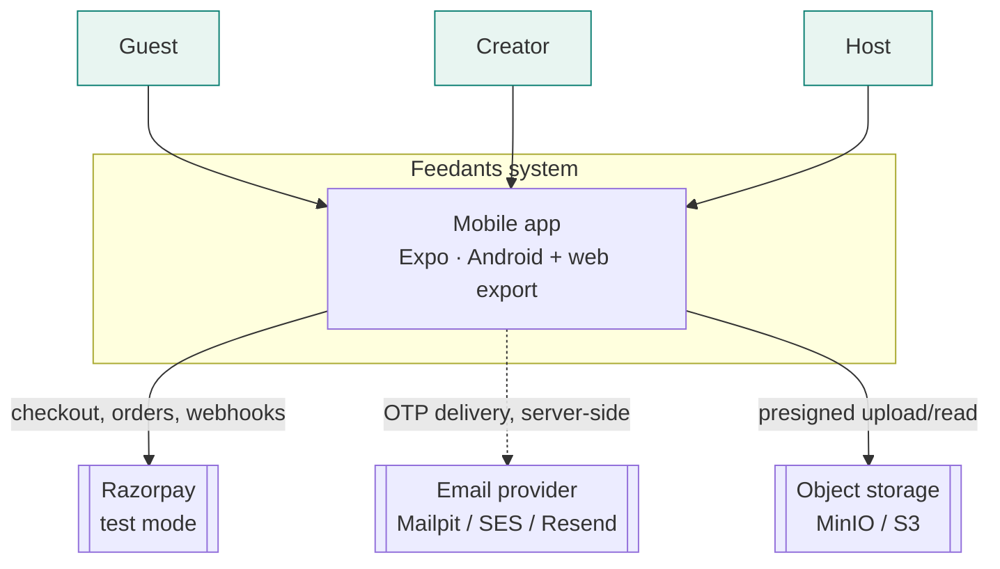
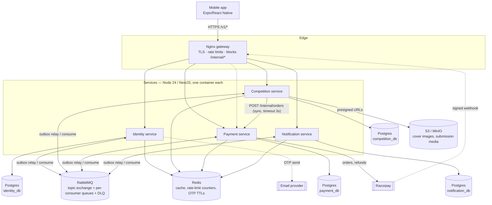
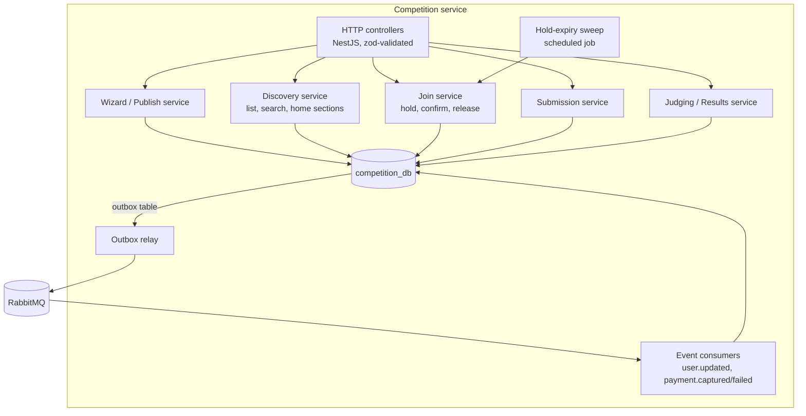
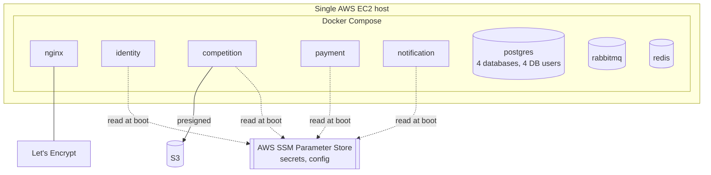

# High-Level Design

| | |
|---|---|
| **Version** | 1.0 (Phase 1) |
| **Status** | Draft for review |
| **Related** | [SRS](../01-requirements/SRS.md) · [Scope](../01-requirements/SCOPE.md) · [ERD](ERD.md) · [Events](EVENTS.md) · [API](API.md) · [Threat model](THREAT_MODEL.md) · [Scaling](SCALING.md) · [Project plan](../PROJECT_PLAN.md) |

Follows the C4 model (context → container → component), per `docs/README.md` conventions. Architecture, stack and service boundaries are fixed by [PROJECT_PLAN.md](../PROJECT_PLAN.md) (SRS constraint C-5); this document works out *how* those boundaries behave — the flows, patterns and failure handling needed to satisfy the SRS.

## 1. C4 — System context



Three user classes (SRS §2.2) share one app and one account model (A-1): a guest browses, a creator joins/submits, a host creates/judges — "host" and "creator" are roles a session can hold simultaneously, not separate account types.

## 2. C4 — Containers



**Why this shape** (PROJECT_PLAN "Approved decisions", elaborated):

| Choice | Reasoning specific to this design |
|---|---|
| Nginx terminates TLS and is the only public listener | Postgres, Redis, RabbitMQ and the services publish no host ports (NFR-SC-01); `/internal/*` (service-to-service, e.g. the reconciliation trigger) is blocked at the edge |
| One synchronous call in the whole system: Competition → Payment `POST /internal/orders` | Joining needs an order ID and Razorpay order ID *before* the app can open checkout — nothing to defer here. Every other cross-service interaction is an event, because nothing else has that "answer needed now" property. A 3 s timeout with one retry; on failure the join request itself fails fast (no hold is created without an order) |
| Razorpay webhooks land on the gateway, routed to Payment | Only Payment holds the webhook secret; other services never see raw webhook payloads |
| RabbitMQ topic exchange, one durable queue per (consumer, event type) pair, each queue backed by a dead-letter queue | Matches PROJECT_PLAN's DLQ-per-consumer + inspect/replay tooling; a topic exchange lets a new consumer subscribe to existing event types without producer changes |

## 3. C4 — Components: Competition service

Competition is the largest service (owns competitions, spots, registrations, submissions, judging, leaderboard, search — PROJECT_PLAN's "stay together, one local transaction" grouping), so it is the one worth expanding to component level.



| Component | Responsibility | Key SRS refs |
|---|---|---|
| Wizard / Publish service | Basics/Prize/Schedule/Review validation, draft save, derived timeline (A-14), calls Payment synchronously to fund, flips `DRAFT → AWAITING_FUNDING → PUBLISHED` on `payment.captured` | FR-HS-01…07 |
| Discovery service | Home section rules (A-18), Explore filters/sort/cursor pagination, full-text + trigram search (A-19) | FR-DS-01…08 |
| Join service | Atomic spot hold, idempotency-key dedupe, order creation call, confirm on `payment.captured`, release on expiry/failure/rejection | FR-PT-01…07 |
| Submission service | Presigned upload URL issuance, draft checklist, final-submit lock | FR-SB-01…05 |
| Judging / Results service | Score capture, publish-results ranking, prize-tier payout trigger, leaderboard read model | FR-JG-01…06 |
| Hold-expiry sweep | Scheduled job (every 30 s) releasing `HELD` registrations past `hold_expires_at`, returning the spot | FR-PT-06, NFR-RL-01 |
| Event consumers | Idempotent handlers keyed by `inbox_events`, one per consumed event type | NFR-RL-03 |

Identity, Payment and Notification are simpler (one dominant transaction script each) and are specified directly at LLD level without an intermediate component diagram: [LLD/identity.md](LLD/identity.md), [LLD/payment.md](LLD/payment.md), [LLD/notification.md](LLD/notification.md).

## 4. Deployment view



One host runs everything via Compose (A-32: an accepted single point of failure for the MVP, revisited at the ~100k-user signal in [SCALING.md](SCALING.md)). Services are stateless — no in-memory session or cache that would break if a second instance started (NFR-SL-01) — so the deployment can grow to multiple containers per service behind a load balancer without a code change, only a Compose/Terraform change.

As built (Phase 5): the same host also runs Jaeger, Prometheus, Alertmanager and node-exporter ([ADR 0007](../adr/0007-self-hosted-observability-on-the-host.md)); deploys, rollback, alerts and backups are described in [DEPLOYMENT.md](../05-operations/DEPLOYMENT.md).

## 5. Consistency patterns

These four patterns are mandatory across all four services (PROJECT_PLAN); this section specifies exactly how, referencing the tables in [ERD.md](ERD.md).

### 5.1 Transactional outbox

Every state change that must notify other services writes two rows in **one Postgres transaction**: the domain row (e.g. `registrations`) and an `outbox_events` row. A separate relay process polls `outbox_events WHERE published_at IS NULL`, publishes to RabbitMQ, then marks `published_at`. If the process crashes between commit and publish, the event is still on disk and gets published on restart — nothing is lost (NFR-RL-03). At-least-once delivery is the resulting guarantee, which is why every consumer must be idempotent.

### 5.2 Idempotent consumers

Each consumer, inside the same transaction as its side effect, inserts `(event_id, consumer_name)` into its `inbox_events` table with a unique constraint. A redelivered event hits the constraint, the transaction is a no-op, and the message is ack'd anyway (it was already handled). This is what makes at-least-once delivery behave like exactly-once from the domain's point of view.

### 5.3 Idempotency keys on writes

Client-originated writes that must never double-execute (join, publish/fund) carry a client-generated `idempotency_key` (UUID). `registrations.idempotency_key` and `orders.idempotency_key` are unique-constrained; a retried request with the same key returns the original result instead of creating a second row (FR-PT-07, US-23).

### 5.4 Saga: join & pay

The riskiest flow in the system (money + a scarce resource + an external webhook), walked through end to end including every failure path (Phase 1 exit criterion).

```mermaid
sequenceDiagram
  participant App
  participant GW as Gateway
  participant Comp as Competition
  participant Pay as Payment
  participant RZP as Razorpay
  participant Sweep as Hold-expiry sweep

  App->>GW: POST /v1/competitions/:id/join (Idempotency-Key)
  GW->>Comp: forward
  Comp->>Comp: TX: spots_remaining--; INSERT registrations(HELD); outbox registration.held
  alt no spots left
    Comp-->>App: 409 NO_SPOTS_LEFT
  else free competition
    Comp->>Comp: TX: registrations.status=CONFIRMED; outbox registration.confirmed
    Comp-->>App: 200 confirmed
  else paid competition
    Comp->>Pay: POST /internal/orders (amount, purpose=ENTRY_FEE, idempotency_key) [sync, 3s timeout]
    Pay->>Pay: INSERT orders(CREATED); create Razorpay order
    Pay-->>Comp: orderId, razorpayOrderId
    Comp-->>App: 200 HELD + order details
    App->>RZP: open Checkout, pay
    RZP-->>App: checkout result (may be lost/closed by user)
    RZP--)GW: signed webhook payment.captured
    GW->>Pay: forward (raw body + signature)
    Pay->>Pay: verify signature; INSERT webhook_events (dedupe by razorpay_event_id)
    Pay->>Pay: TX: orders.status=CAPTURED; ledger entries (escrow debit? no: user fee split); outbox payment.captured
    Pay--)Comp: (async) payment.captured
    alt hold still valid, spot still theirs
      Comp->>Comp: TX: registrations.status=CONFIRMED; outbox registration.confirmed
      Comp--)Notif: (async) registration.confirmed
    else hold expired / spot lost (late capture)
      Comp->>Comp: TX: registrations.status=REJECTED; outbox registration.rejected
      Comp--)Pay: (async) registration.rejected
      Pay->>Pay: TX: refunds(PENDING); call Razorpay Refunds API; ledger reversal
      Pay--)Notif: (async) payment.refunded
    end
  end

  Sweep->>Comp: every 30s: HELD rows past hold_expires_at
  Sweep->>Comp: TX: spots_remaining++; registrations.status=EXPIRED; outbox registration.expired
```

**Failure paths covered:**

| Failure | Handling | Requirement |
|---|---|---|
| No spot left at join | Conditional `UPDATE` affects 0 rows → 409 before any hold or order is created | FR-PT-01, NFR-RL-01 |
| App closed / user abandons Checkout | Hold simply expires at `hold_expires_at`; sweep releases the spot | FR-PT-06 |
| Payment fails at Razorpay | `payment.failed` webhook → order `FAILED`, registration stays `HELD` until its own TTL, app shows retry (US-21) | FR-PT-06 |
| Payment captured *after* the hold already expired and the spot was re-taken | Competition rejects on `payment.captured` (registration not `HELD` anymore) → emits `registration.rejected` → Payment auto-refunds in full | FR-PT-06, US-22 |
| Duplicate join click / client retry | Same `Idempotency-Key` → same `registrations` row returned, no second spot decrement | FR-PT-07, US-23 |
| Duplicate or out-of-order webhook delivery | `webhook_events.razorpay_event_id` unique constraint + `inbox_events` on the Competition side → processed once regardless of delivery count or order | FR-PY-02, NFR-RL-02, US-23 |
| Payment service down when join is attempted | Synchronous call times out (3 s) → join request fails with 503 before any hold is committed (nothing partially created) | NFR-RL-04 (join is never left half-done) |
| Notification service down during the whole flow | Notification's `registration.confirmed` consumer is offline; RabbitMQ retains the queued message; delivered on recovery | NFR-RL-04, US-32 |

### 5.5 Other sagas (same patterns, summarised)

| Saga | Steps | Compensation on failure |
|---|---|---|
| **Publish (fund)** | `DRAFT →` sync order to Payment (`PRIZE_FUNDING`) `→ AWAITING_FUNDING →` webhook `payment.captured →` `PUBLISHED`, outbox `competition.published` | Funding fails/abandoned → stays `DRAFT`, no charge (US-15) |
| **Cancel** | Host cancels `PUBLISHED →` for each `CONFIRMED` registration: outbox `registration.refund_requested` → Payment refunds + returns escrow to host wallet → `CANCELLED`, outbox `competition.cancelled` | Idempotent per registration; a competition with zero confirmed registrations skips straight to `CANCELLED` |
| **Publish results** | Host publishes (all submissions scored) → rank, compute payouts → ledger credits from escrow to winners' wallets + unawarded tiers to host + host's entry-fee revenue (A-10) → `RESULTS_PUBLISHED`, outbox `competition.results_published` | All-or-nothing in one Competition transaction that emits one outbox event; Payment applies the resulting ledger postings idempotently keyed by `competition.results_published`'s event ID |

## 6. What this design deliberately does not do

Mirrors PROJECT_PLAN's "explicitly not used" list, restated as design choices: no service mesh or service discovery server (four services, static Compose DNS names is enough); no event sourcing outside the append-only ledger (state lives in normal tables, events are notifications of state that already changed, not the source of truth); no distributed transaction coordinator (2PC) — the saga + compensation pattern above is used instead, matching the "failure paths as first-class design" requirement rather than pretending atomicity across services is possible.
