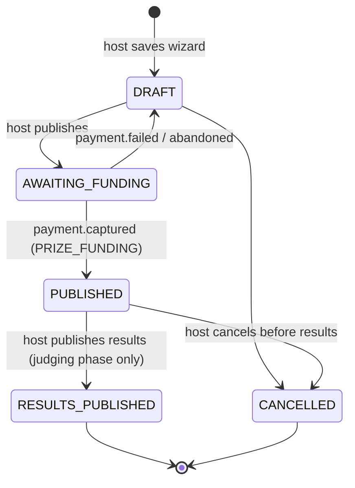
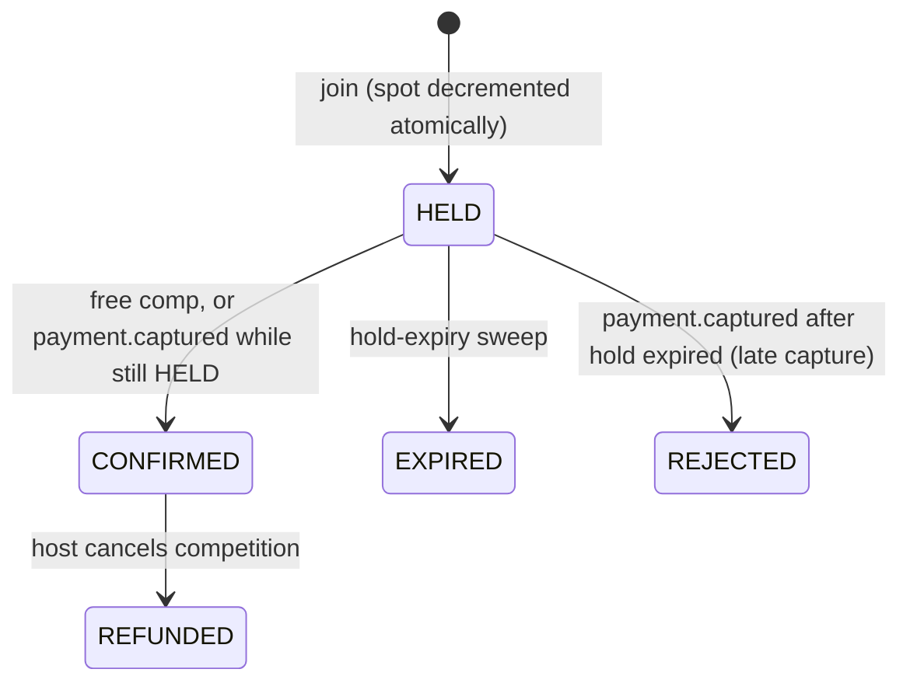

# LLD — Competition service

| | |
|---|---|
| **Owns** | Competitions, spots, registrations, submissions, judging, leaderboard, search ([PROJECT_PLAN.md](../../PROJECT_PLAN.md)) |
| **Database** | `competition_db` — see [ERD §3](../ERD.md#3-competition-service--competition_db) |
| **API** | [API.md §3](../API.md#3-competition-service) |
| **Events** | [EVENTS.md §4](../EVENTS.md#4-events-published-by-competition) |
| **Components** | [HLD §3](../HLD.md#3-c4--components-competition-service) |

Registrations and submissions live in the same service as competitions deliberately — they need one local transaction with the spot count (PROJECT_PLAN), which a cross-service call could never give atomically.

## 1. Competition lifecycle (from SRS §2.5)



Phase (while `PUBLISHED`) is **derived, never stored**, from `now()` against `registration_opens_at` / `registration_closes_at` / `submission_starts_at` / `submission_ends_at` (SRS §2.5 table) — computed in the read path so it is always correct without a sweep keeping a `phase` column in sync.

### Derived timeline (A-14)

Given wizard inputs start `S` and duration `D`:

```
registration_opens_at    = S
submission_starts_at     = S
registration_closes_at   = S + ceil(D / 3)     // REGISTRATION_CLOSE_RATIO, config
submission_ends_at       = S + D
results_due_at           = S + D + 2 days       // RESULTS_DUE_BUFFER_DAYS, config
```

Computed once at publish and stored (not recomputed on read), so a later config change never reflows an already-published competition's dates.

## 2. Registration state machine



### Joining

Single-competition-row, single-transaction write (ERD §3 "concurrency-critical write"):

```sql
BEGIN;
UPDATE competitions SET spots_remaining = spots_remaining - 1
  WHERE id = :competitionId AND spots_remaining > 0;
-- 0 rows updated => ROLLBACK, return 409 NO_SPOTS_LEFT
INSERT INTO registrations (id, competition_id, creator_id, status, idempotency_key, hold_expires_at)
  VALUES (:id, :competitionId, :creatorId, 'HELD', :idempotencyKey, now() + interval ':holdTtl minutes');
INSERT INTO outbox_events (...) VALUES (..., 'registration.held', ...);
COMMIT;
```

Preconditions checked before the transaction (FR-PT-01): signed in, phase is Open (derived), no existing `HELD`/`CONFIRMED` registration for this `(competitionId, creatorId)` (enforced again by the partial unique index as the authoritative guard against a race), requester is not the host.

- **Free competition**: same transaction additionally sets `status = 'CONFIRMED'`, outbox `registration.confirmed` — no Payment call.
- **Paid competition**: after commit, synchronously calls Payment `POST /internal/orders` (amount = entry fee + platform fee, purpose `ENTRY_FEE`, the same `idempotencyKey`); returns `HELD` + checkout details to the app. If the call times out (3 s), the whole request fails **before** this point is reached in a retried call — see idempotency note below.
- **Idempotent retry** (FR-PT-07): the `registrations.idempotency_key` unique constraint means a retried `POST /join` with the same header either (a) hits the constraint and the handler re-reads and returns the existing row, or (b) if the first attempt never got past the spot decrement (crashed before commit), the transaction never committed and a retry proceeds normally — no partial state is ever visible.

### Hold-expiry sweep

Scheduled job, every 30 s (config `HOLD_SWEEP_INTERVAL_SECONDS`):

```sql
UPDATE registrations SET status = 'EXPIRED'
  WHERE status = 'HELD' AND hold_expires_at < now()
  RETURNING id, competition_id;
-- for each row, in the same transaction as its own update:
UPDATE competitions SET spots_remaining = spots_remaining + 1 WHERE id = :competitionId;
INSERT INTO outbox_events (...) VALUES (..., 'registration.expired', ...);
```

Batched per row in its own transaction so one bad row can't block the sweep of the rest.

### Consuming `payment.captured` / `payment.failed`

Matched by `idempotency_key` (Competition's `registrations.idempotency_key` == the key Payment echoes back in the event, per [EVENTS.md](../EVENTS.md#5-events-published-by-payment)):

```
IF registration.status == HELD AND still within hold_expires_at:
    status = CONFIRMED; outbox registration.confirmed
ELSE (expired or already EXPIRED/REJECTED — late capture):
    status = REJECTED; outbox registration.rejected {registrationId, creatorId, orderId}
```

`payment.failed`: registration stays `HELD` (it may still be retried before the hold's own TTL) — nothing to change on the registration; Notification handles the user-facing "payment failed" message directly from the Payment event.

## 3. Submission checklist (A-24)

Completion % = (media uploaded ? 1 : 0 + caption ≥ 10 chars ? 1 : 0 + rules_accepted ? 1 : 0) / 3. Computed on read, not stored, so it can never drift from the underlying fields. `PATCH .../submission` accepts partial updates (autosave); `POST .../submit` re-validates all three, phase == Submissions, and `registrations.status == CONFIRMED`, then sets `status = SUBMITTED`, `submitted_at = now()` and makes the row immutable at the application layer (no further `PATCH` accepted once `SUBMITTED` — checked before every write, not relied on client-side).

## 4. Judging and results publication (FR-JG-01…05)

- `PUT /submissions/{id}/score`: allowed only in the judging phase (derived), only by the competition's host; overwritable until results are published.
- `POST /competitions/{id}/publish-results`:
  1. Guard: every `SUBMITTED` submission for the competition has a non-null `score` — else 409.
  2. Rank by `score DESC`, ties broken by `submitted_at ASC` (A-28).
  3. Assign `prize_tiers` to ranks 1..N (N = `LEAST(submission_count, tier_count)`); tiers beyond N are unawarded (A-29).
  4. Compute `hostRevenuePaise` = `entry_fee_paise × confirmed_registration_count − platform_fee_paise × confirmed_registration_count` (A-10 — credited now, at publish, not at join).
  5. One transaction: `competitions.status = RESULTS_PUBLISHED`, `results_published_at = now()`; outbox `competition.results_published` with the full payload from [EVENTS.md](../EVENTS.md#competitionresults_published) — Payment and Notification react from this single event, no further calls out.
  6. Response and the leaderboard read (`GET /competitions/{id}/leaderboard`) are the same ranked projection, served straight from `submissions`/`prize_tiers` — no separate materialised leaderboard table needed at MVP scale (A-31: ~1k open competitions).

## 5. Discovery

- **Home** (`GET /v1/home`, A-18): each section is its own indexed query (see ERD §3 indexes), run in parallel, `LIMIT`-bounded, cached in Redis 60 s + jitter (PROJECT_PLAN caching table), invalidated early on `competition.updated`-equivalent internal writes (publish, cancel).
- **Explore/Search**: cursor pagination is `(sort_key, id) > (last_sort_key, last_id)`, never `OFFSET`, so page N costs the same as page 1 (NFR-PF-03). Search combines `pg_trgm` similarity with `tsvector` full-text (A-19); a rewrite to OpenSearch is a config/consumer change only (see [SCALING.md](../SCALING.md)), not a rewrite.

## 6. Configuration

| Key | Default | Notes |
|---|---|---|
| `SPOT_HOLD_TTL_MINUTES` | 10 | A-22 |
| `HOLD_SWEEP_INTERVAL_SECONDS` | 30 | |
| `REGISTRATION_CLOSE_RATIO` | 3 (i.e. D/3) | A-14 |
| `RESULTS_DUE_BUFFER_DAYS` | 2 | A-14 |
| `MIN_START_LEAD_HOURS` | 1 | A-16 |
| `PRIZE_POOL_MIN_PAISE` / `MAX_PAISE` | 50000 / 10000000 | A-12 |
| `ENTRY_FEE_MIN_PAISE` / `MAX_PAISE` | 1000 / 500000 | A-12 |
| `MAX_SPOTS_MIN` / `MAX` | 2 / 10000 | A-16 |
| `PLATFORM_FEE_PERCENT` | 10 | A-8 |
| `PRIZE_TIER_TABLE` | see A-11 | ≥₹6000→6, ≥₹3000→5, ≥₹1200→4, else 3 winners; rounded to ₹10, remainder to 1st |
| `HOME_ENDING_SOON_WINDOW_HOURS` | 48 | A-18 |
| `HOME_TRENDING_WINDOW_DAYS` | 7 | A-18 |

## 7. Health and scheduled jobs

- `GET /health/live`, `GET /health/ready` (Postgres, Redis, RabbitMQ) — NFR-MT-05.
- Hold-expiry sweep (§2), registration-open notify sweep (§2 of [EVENTS.md](../EVENTS.md#competitionregistration_opened) — sets `registration_opened_notified_at` once per competition, outbox `competition.registration_opened`).
