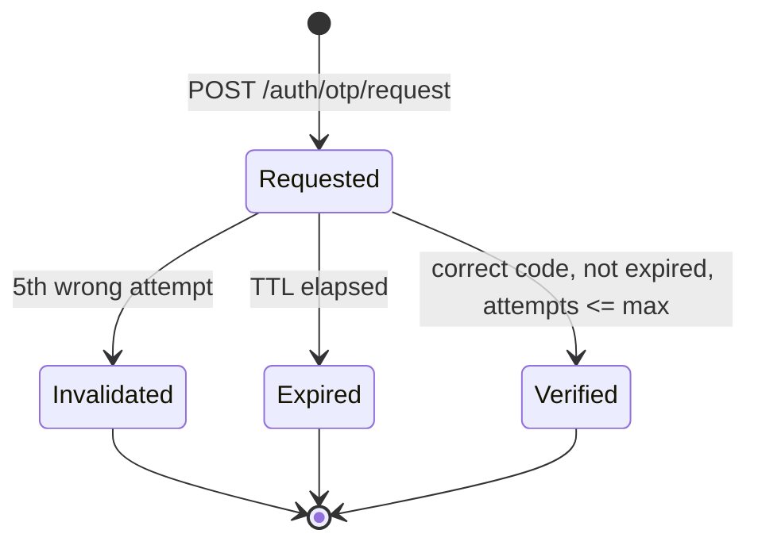

# LLD — Identity service

| | |
|---|---|
| **Owns** | Users, OTP, tokens, profile ([PROJECT_PLAN.md](../../PROJECT_PLAN.md)) |
| **Database** | `identity_db` — see [ERD §2](../ERD.md#2-identity-service--identity_db) |
| **API** | [API.md §2](../API.md#2-identity-service) |
| **Events** | [EVENTS.md §3](../EVENTS.md#3-events-published-by-identity) |

## 1. Responsibility boundary

Identity is the only service that ever sees an email address at rest for auth purposes, and the only signer of access tokens. Every other service **verifies** tokens locally against the JWKS endpoint — it never calls Identity per request (NFR-SL-01, keeps Identity off the hot path of every other service).

## 2. OTP login state machine



- Code: 6 digits, generated with a CSPRNG, hashed with argon2id before storage (`otp_requests.code_hash`) — never stored or logged in plaintext (NFR-SC-07).
- TTL default 5 min, resend cooldown default 60 s, max attempts default 5 — all `@nestjs/config` values, not literals (NFR-MT-03).
- Rate limiting (NFR-SC-03): Redis counter keyed by `email` and by `ip`, both enforced at `/auth/otp/request`.

## 3. Token issuance and rotation

- Access token: RS256, 15 min default TTL, claims `{ sub: userId, iat, exp }` — no PII beyond the user ID, so a leaked token exposes nothing about the person.
- Refresh token: opaque random value, stored only as a SHA-256 hash (`refresh_tokens.token_hash`); the raw value is returned to the client once and never persisted server-side in recoverable form.
- **Rotation with reuse detection** (FR-ID-04, US-03): every `/auth/refresh` call marks the presented token `revoked_at = now()`, sets its `replaced_by_id`, and issues a new row in the same `family_id`. If a token that already has `revoked_at` set is presented again (the token was stolen and used after the legitimate client rotated), every row in that `family_id` is revoked — the whole device session dies, forcing re-authentication.
- Signing key rotation: `signing_keys` holds overlapping active/retiring keys so tokens signed just before a rotation still verify during the retirement grace window; the JWKS endpoint serves every key with `retired_at IS NULL OR retired_at > now() - grace`.

## 4. Sequence — sign-in

```mermaid
sequenceDiagram
  participant App
  participant Id as Identity
  participant Email as Email provider

  App->>Id: POST /auth/otp/request {email}
  Id->>Id: rate-limit check (Redis)
  Id->>Id: INSERT otp_requests(code_hash, expires_at)
  Id->>Email: send code
  App->>Id: POST /auth/otp/verify {email, code}
  Id->>Id: attempts++; compare hash; check expiry
  alt correct
    Id->>Id: SELECT/INSERT users; outbox user.created if new
    Id-->>App: {accessToken, refreshToken, isNewUser}
  else wrong (< max attempts)
    Id-->>App: 400 OTP_INCORRECT {attemptsRemaining}
  else wrong (== max attempts) or expired
    Id-->>App: 410 OTP_INVALIDATED / OTP_EXPIRED
  end
```

## 5. Public-profile aggregation

`GET /v1/users/{id}/public-profile` (FR-ID-07) needs both Identity data (name, avatar) and Competition data (competitions joined/won, total winnings). Since no service reads another's database (NFR-SL-02), the route is served by **Competition**, which already holds `registrations` and results, and which already caches `host_display_name_cache`/`host_avatar_url_cache` for hosts via `user.updated` — the same cache-from-event pattern extended to any user who has ever registered. Identity's own `GET /v1/me` remains the source of truth for the signed-in user's own editable fields. This split is recorded so the API.md route list and the implementation don't drift; confirmed with an ADR before Sprint 2 if the split proves awkward in practice.

## 6. Account deletion (FR-ID-09)

`DELETE /v1/me`: `users.status = DELETED`, `email` replaced with a non-reversible placeholder (`deleted-<uuid>@invalid`), `display_name` replaced with "Deleted user", `avatar_url`/`bio` cleared, all `refresh_tokens` revoked, outbox `user.deleted`. Competition and Payment **do not** delete their historical rows (ledger and competition history are retained per FR-ID-09) — they simply stop refreshing the cached display name, which is now the anonymised value.

## 7. Configuration (no hard-coded values, NFR-MT-03)

| Key | Default | Notes |
|---|---|---|
| `OTP_TTL_SECONDS` | 300 | |
| `OTP_RESEND_COOLDOWN_SECONDS` | 60 | |
| `OTP_MAX_ATTEMPTS` | 5 | |
| `ACCESS_TOKEN_TTL_SECONDS` | 900 | |
| `REFRESH_TOKEN_TTL_DAYS` | 30 | |
| `SIGNING_KEY_RETIREMENT_GRACE_HOURS` | 24 | |

## 8. Health and scheduled jobs

- `GET /health/live`, `GET /health/ready` (checks Postgres, Redis) — NFR-MT-05.
- Sweep: delete `otp_requests` older than 1 day; delete `refresh_tokens` past `expires_at` by more than 30 days (storage hygiene only, not a security boundary — revocation is immediate via `revoked_at`).
