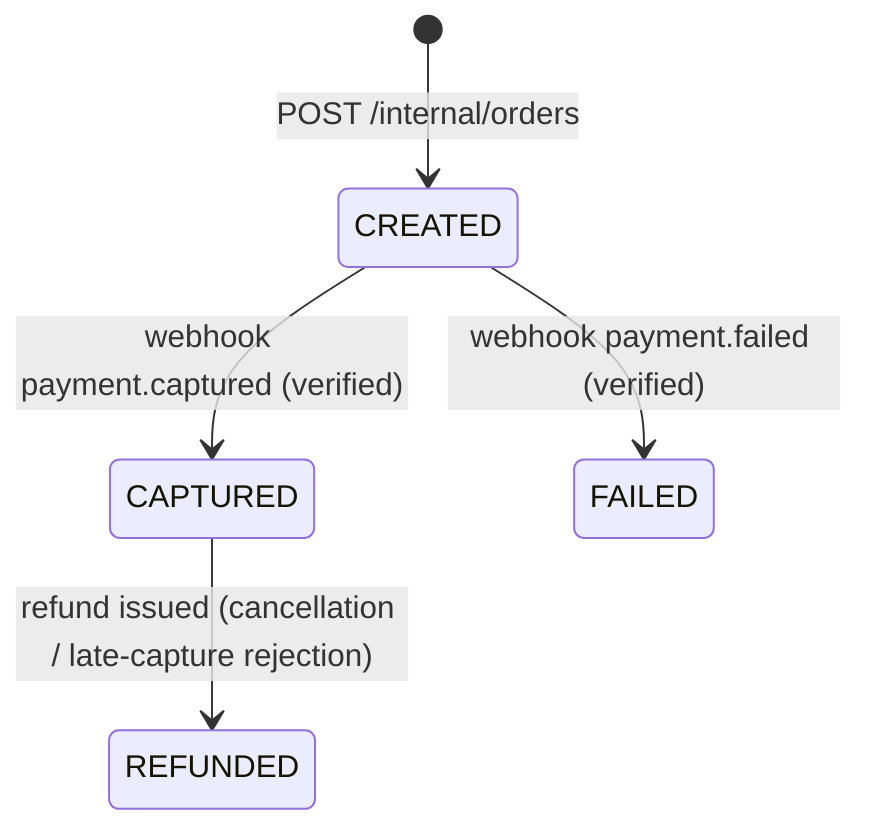

# LLD — Payment service

| | |
|---|---|
| **Owns** | Orders, webhooks, ledger, refunds, payouts ([PROJECT_PLAN.md](../../PROJECT_PLAN.md)) |
| **Database** | `payment_db` — see [ERD §4](../ERD.md#4-payment-service--payment_db) |
| **API** | [API.md §4](../API.md#4-payment-service) |
| **Events** | [EVENTS.md §5](../EVENTS.md#5-events-published-by-payment) |

Money is isolated in its own service for security and correctness (PROJECT_PLAN). Nothing here trusts a client-supplied amount; every amount Payment ever posts either came from a same-service ledger read or from a caller that computed it server-side (Competition, using its own config).

## 1. Order state machine



## 2. Order creation (`POST /internal/orders`)

```
1. Look up orders WHERE idempotency_key = :key
   -> if found, return it unchanged (no new Razorpay order, no new row)
2. INSERT orders(status=CREATED, amount_paise=:amount, purpose, reference_type, reference_id, idempotency_key)
3. Call Razorpay Orders API with amount_paise, currency=INR, receipt=order.id
4. UPDATE orders SET razorpay_order_id = :fromRazorpay
5. Return {orderId, razorpayOrderId, amountPaise} for the app to open Checkout with
```

Amount is never accepted from the caller's client — it is accepted from the **caller service** (Competition), which itself computed it from its own config (entry fee + platform fee, or prize pool) and never from anything the mobile app sent. This is the enforcement point for "a tampered amount is ignored" (US-20).

## 3. Webhook ingestion (`POST /v1/payments/webhook/razorpay`)

```
1. Verify HMAC-SHA256 signature over the RAW request body using the webhook secret
   -> invalid signature: 400, INSERT webhook_events(signature_valid=false), do not process further
2. INSERT webhook_events(razorpay_event_id, event_type, raw_payload, signature_valid=true)
   -> unique constraint on razorpay_event_id: a duplicate delivery hits the constraint,
      the handler catches it and returns 200 without reprocessing (NFR-RL-02)
3. Parse event_type:
   payment.captured -> mark order CAPTURED, post ledger entries, outbox payment.captured
   payment.failed    -> mark order FAILED, outbox payment.failed
   refund.processed  -> mark refunds row PROCESSED
4. UPDATE webhook_events SET processed_at = now()
```

Signature verification happens on the **raw** body (before JSON parsing / any framework body transformation) — a common source of signature-mismatch bugs, called out explicitly because NestJS's default body parser must be bypassed for this one route (`rawBody: true`).

### Ledger postings on `payment.captured`

Per A-10, entry-fee revenue reaches the host only at results publication (so a cancellation can still refund it in full) — until then it is money "this competition holds but hasn't reached a person yet", which is exactly what the escrow account already represents. So the non-platform portion of an entry fee is credited to the same `COMPETITION_ESCROW` account as prize funding, not to a separate account:

| Purpose | Credit | Amount |
|---|---|---|
| `ENTRY_FEE` capture | `PLATFORM` account | `platform_fee_paise` |
| `ENTRY_FEE` capture | this competition's `COMPETITION_ESCROW` account | `amount_paise − platform_fee_paise` |
| `PRIZE_FUNDING` capture | this competition's `COMPETITION_ESCROW` account | `amount_paise` (the full prize pool) |

Entry fees have no matching debit account (they are external money entering the system, not a transfer between two accounts Payment tracks) — the ledger transaction for a capture is a single credit row balanced by a rounding-safe debit posted to a system-level `EXTERNAL_INFLOW` pseudo-account, keeping the "every transaction sums to zero" invariant (§5) true even for money that originates outside the ledger.

At `competition.results_published`, the escrow account is drained: winners are paid from it, unawarded tiers and the accumulated entry-fee revenue both flow to the host (FR-PY-04, FR-PY-05, A-10).

## 4. Sequence — cancellation refund + escrow return

```mermaid
sequenceDiagram
  participant Comp as Competition
  participant Pay as Payment
  participant RZP as Razorpay

  Comp--)Pay: competition.cancelled {competitionId, hostId, confirmedRegistrations[]}
  loop each confirmed registration
    Pay->>Pay: INSERT refunds(PENDING) for its orderId
    Pay->>RZP: Refunds API, full amount
    RZP-->>Pay: refund id
    Pay->>Pay: TX: ledger reversal (credit back from escrow, debit platform fee too — full refund means the platform fee is also returned); refunds.status=PROCESSED
    Pay--)Notif: (async) payment.refunded
  end
  Pay->>Pay: TX: remaining escrow balance for competitionId -> credit host's USER ledger account, debit COMPETITION_ESCROW
```

Idempotent by `(eventId, competitionId)` recorded in `inbox_events` — a redelivered `competition.cancelled` is a no-op even though it lists multiple registrations, because the whole handler runs as one logical unit gated by the inbox check before any refund call is attempted.

## 5. Ledger invariant enforcement (FR-PY-03, NFR-RL-05)

Every write to `ledger_entries` happens through a single internal `postLedgerTransaction(description, referenceType, referenceId, entries[])` helper that:

1. Asserts `entries.reduce((s, e) => s + e.amountPaise, 0) === 0` in application code before insert (fail fast, cheap check).
2. Relies on a Postgres `CONSTRAINT TRIGGER ... DEFERRABLE INITIALLY DEFERRED` that re-sums `ledger_entries` per `transaction_id` at commit and raises if non-zero — the actual integrity guarantee, independent of application code correctness.

No other code path writes to `ledger_entries` — this is enforced by repository-layer convention and a code-review checklist item (NFR-MT-07 area), not by a DB grant, since the same service role owns the table.

## 6. Reconciliation job (FR-PY-08, Could)

Daily (`POST /internal/reconciliation/run`, triggered by a scheduler): for each `orders` row `CAPTURED` in the last 24 h, confirm a matching `ledger_transactions` row referencing it exists and its entries sum to the order amount split correctly; report mismatches to logs/Sentry for manual review. Does not auto-correct — a mismatch is always a bug to investigate, never silently patched.

## 7. Configuration

| Key | Default | Notes |
|---|---|---|
| `RAZORPAY_KEY_ID` / `RAZORPAY_KEY_SECRET` | — (SSM/`.env`, never committed) | test-mode keys only (C-1) |
| `RAZORPAY_WEBHOOK_SECRET` | — (SSM/`.env`) | |
| `ORDER_CREATE_TIMEOUT_MS` | 3000 | matches the sync-call timeout in [HLD §2](../HLD.md#2-c4--containers) |
| `RECONCILIATION_SCHEDULE_CRON` | `0 3 * * *` | daily at 03:00 UTC |

## 8. Health

- `GET /health/live`, `GET /health/ready` (Postgres, Redis, RabbitMQ, and a lightweight Razorpay reachability check) — NFR-MT-05.
