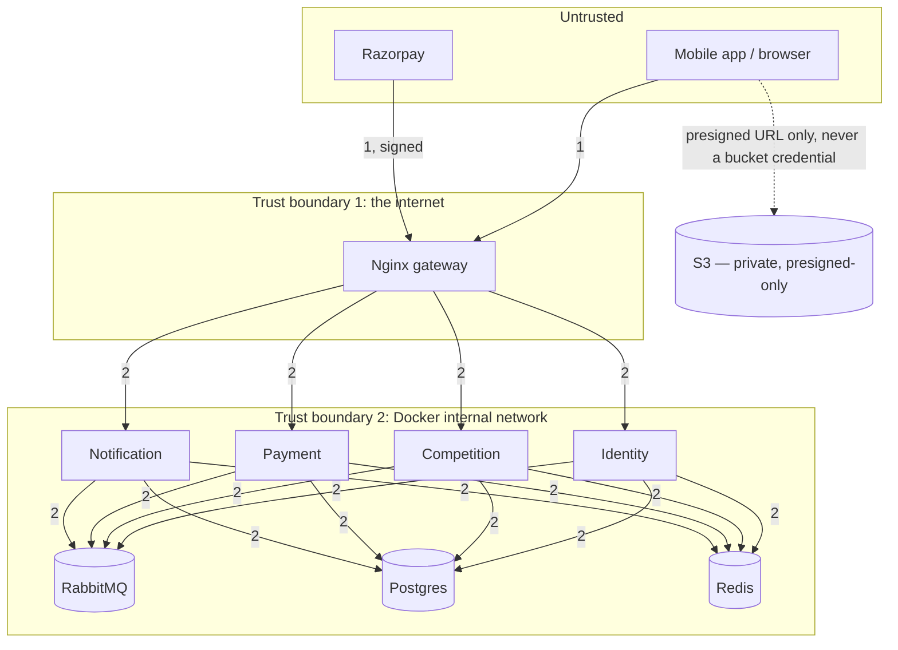

# Threat Model (STRIDE)

| | |
|---|---|
| **Version** | 1.0 (Phase 1) |
| **Status** | Draft for review |
| **Related** | [SRS §4.3](../01-requirements/SRS.md#43-security-and-privacy) · [HLD](HLD.md) · [ERD](ERD.md) · [API](API.md) |

STRIDE = Spoofing, Tampering, Repudiation, Information disclosure, Denial of service, Elevation of privilege. Each threat lists the mitigation already designed in, and its NFR/FR reference — this is a design artefact, re-run against the real implementation in Phase 4 ([SECURITY_REVIEW.md](../04-testing/SECURITY_REVIEW.md)) with CodeQL/Trivy/ZAP (NFR-SC-08).

## 1. Trust boundaries

Everything inside boundary 2 is reachable only from other containers on the same Docker network — no host ports are published for Postgres, Redis or RabbitMQ (NFR-SC-01). The client never holds a credential for S3 directly, only short-lived presigned URLs.

## 2. Assets

| Asset | Why it matters |
|---|---|
| Refresh tokens / access tokens | Full account takeover if stolen |
| OTP codes | Account takeover if guessable/leaked before use |
| Payment webhook secret | Forged `payment.captured` events would mint free confirmed registrations and drain escrow |
| Ledger (`ledger_entries`) | Directly represents money; corruption or unauthorised writes are a financial-integrity incident |
| PII (email, display name, avatar, bio) | FR-ID-09, NFR-SC-07, India DPDP Act 2023 awareness |
| Media in S3 | Copyright/moderation surface even without automated moderation (A-5) |

## 3. STRIDE by flow

### 3.1 OTP login

| Threat | Scenario | Mitigation | Ref |
|---|---|---|---|
| Spoofing | Attacker requests OTPs for a victim's email and brute-forces the code | 6-digit code, 5-attempt lockout, 5 min TTL, per-email + per-IP rate limit on both request and verify | FR-ID-01/02, NFR-SC-03 |
| Information disclosure | OTP code logged or stored in plaintext, readable by anyone with DB/log access | Code stored only as an argon2id hash; PII/secret redaction in structured logs | NFR-SC-07 |
| Denial of service | Attacker floods `/otp/request` for one email, locking the real user out of receiving usable codes / exhausting email quota | Rate limit is the primary control; secondary: cooldown between resends makes flooding costly per attempt | NFR-SC-03 |
| Repudiation | User claims they never signed in | `otp_requests`/`refresh_tokens` retain `requested_ip`, `created_at`, device label for audit | — |

### 3.2 Token issuance and use

| Threat | Scenario | Mitigation | Ref |
|---|---|---|---|
| Spoofing | Forged JWT | RS256, verified locally against JWKS; only Identity holds the private key | FR-ID-04 |
| Tampering | Refresh token reuse after rotation (stolen token used post-legitimate-rotation) | Reuse detection revokes the entire token family — see [LLD/identity.md §3](LLD/identity.md#3-token-issuance-and-rotation) | FR-ID-04, US-03 |
| Elevation of privilege | Client sets `sub` or any ownership field itself in a request body | Ownership is always taken from the verified token, never from the request body; every resource route checks it server-side | NFR-SC-02 |
| Information disclosure | Access token payload leaks PII if intercepted | Claims are limited to `{sub, iat, exp}` — no email/name in the token | NFR-SC-07 |

### 3.3 Join and pay (the highest-value flow)

| Threat | Scenario | Mitigation | Ref |
|---|---|---|---|
| Tampering | Client sends a lower amount than the real entry fee | Amount is computed server-side by Competition and passed to Payment's internal order-create call; the client never supplies it | FR-PT-04, US-20 |
| Spoofing | Forged webhook claiming a payment was captured | HMAC signature over the raw body, verified before any processing; unsigned/invalid payloads are stored but never acted on | FR-PY-02, NFR-SC-06 |
| Repudiation / replay | Same webhook delivered twice is treated as two payments | `webhook_events.razorpay_event_id` unique constraint + idempotent consumer on the Competition side | NFR-RL-02 |
| Denial of service | Attacker holds spots without paying, starving real users of the last spot | Hold TTL (10 min) auto-releases; a spot can only ever be held, never permanently reserved, by an unpaid request | FR-PT-02, A-22 |
| Elevation of privilege | A registration is confirmed for someone other than the person who paid | `idempotency_key` binds one registration to one order; Competition only confirms the registration whose key matches the captured order | FR-PT-07 |
| Information disclosure | Card data touches Feedants' servers | Checkout is entirely Razorpay-hosted; no card data ever reaches the app or any service | NFR-SC-06 |

### 3.4 Ledger and wallet

| Threat | Scenario | Mitigation | Ref |
|---|---|---|---|
| Tampering | A bug (or an attacker with DB access) edits or deletes a ledger row to inflate a balance | `ledger_entries` is written only through one internal helper, never updated/deleted at the application layer; a DB-level deferred constraint trigger rejects any transaction whose entries don't sum to zero | FR-PY-03, NFR-RL-05 |
| Elevation of privilege | A user reads or credits another user's wallet | `GET /v1/wallet` derives the balance from `ledger_accounts` scoped to the token's `sub`; no route accepts a target user ID for wallet reads | NFR-SC-02 |
| Repudiation | A host disputes a payout amount | Ledger is append-only with `reference_type`/`reference_id` on every transaction, traceable back to the competition/order/refund that caused it | FR-PY-03 |

### 3.5 Submissions and uploads

| Threat | Scenario | Mitigation | Ref |
|---|---|---|---|
| Tampering | Client uploads an executable or oversized file disguised with an image extension | Presigned PUT URL is scoped to a specific content type and a max size (S3 policy conditions), enforced by the bucket, not just client-side validation | FR-SB-01/02 |
| Elevation of privilege | A creator overwrites another creator's submission media via a guessed S3 key | Object keys are namespaced by `registrationId` (a UUID only the owner and the server know), and the presigned URL is issued only to the registration's owner | NFR-SC-02 |
| Denial of service | Storage cost/abuse from unlimited uploads | Per-type size caps (A-23); S3 lifecycle rule expires abandoned (never-finalised) uploads | SRS §5 Object storage |
| Information disclosure | Submission media readable by anyone with the URL, indefinitely | Read access is also via short-lived presigned GET URLs where the content isn't meant to be public; published competition media (cover images, submitted entries after judging) may be served through a longer-lived signed URL appropriate to its public nature — decided per asset type in implementation, private bucket throughout | SRS §5 |

### 3.6 Cross-service events

| Threat | Scenario | Mitigation | Ref |
|---|---|---|---|
| Tampering | A rogue container publishes a forged `payment.captured` onto the exchange | RabbitMQ credentials are per-service and scoped (least privilege — a service's user can publish only to its own outbox-relay pattern and consume only its declared queues); the message broker itself sits inside the internal trust boundary, unreachable from the internet | NFR-SC-01, NFR-SL-02 |
| Denial of service | A poison message repeatedly crashes a consumer, blocking the queue | Per-consumer dead-letter queue after N retries — a bad message is quarantined, not left blocking | PROJECT_PLAN DLQ pattern |
| Information disclosure | Event payloads carry more PII than the consumer needs | Payloads are reviewed per event in [EVENTS.md](EVENTS.md) to include only what the consumer's use case requires (e.g. `user.updated` carries display name/avatar, not email) | NFR-SC-07 |

## 4. Supply chain and infrastructure

| Threat | Mitigation | Ref |
|---|---|---|
| Secret committed to the public repo | gitleaks pre-commit and in CI; `.env` gitignored; production secrets only in SSM Parameter Store (SecureString) | NFR-SC-05, R-6 |
| Vulnerable dependency or base image | Dependabot, CodeQL, Trivy on every image and on Terraform; release blocked on high/critical findings | NFR-SC-08 |
| Compromised host reachable via SSH | SSH port closed; access only via AWS SSM Session Manager (audited, IAM-gated) | NFR-SC-01 |
| Compromised container escalates to other services | Non-root containers; each service has its own least-privilege DB user with access to only its own database | NFR-SL-02, PROJECT_PLAN |

## 5. Explicitly accepted residual risk (MVP)

| Risk | Why accepted | Revisit when |
|---|---|---|
| Single EC2 host is a single point of failure | Cost/scope trade-off for a 12-week MVP (A-32) | Availability target rises above 99.5% — see [SCALING.md](SCALING.md) |
| No automated content moderation on submissions | Hosts judge what they receive; demo-scale usage (A-5) | App opens beyond demo users |
| No WAF in front of Nginx | Rate limiting + input validation cover the MVP threat model at this traffic scale | ZAP findings or real abuse in Phase 4/6 |
