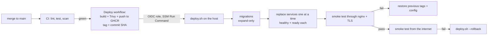

# Deployment

| | |
|---|---|
| **Stories** | US-37 (deploy with rollback), US-38 (alerts), US-39 (backups) |
| **Related** | [HLD §4](../02-design/HLD.md#4-deployment-view) · [infra/](../../infra/README.md) · [runbooks/](runbooks/) · [ADR 0007](../adr/0007-self-hosted-observability-on-the-host.md) |

One EC2 host runs the whole stack with Docker Compose (A-32). Terraform creates it; every green build of `main` deploys to it automatically, service by service, and rolls back on its own when a smoke test fails.



## 1. What runs where

| Piece | Where | Notes |
|---|---|---|
| Gateway (nginx + OpenTelemetry module) | host, ports 80/443 | The only public listener. TLS from Let's Encrypt, renewed by a systemd timer |
| Identity, Competition, Payment, Notification | host, internal network | Images `ghcr.io/<owner>/feedants-<service>:<sha>`, one tag per service in `/opt/feedants/release.env` |
| PostgreSQL, Redis, RabbitMQ | host, internal network | No published ports; RabbitMQ's management UI on 127.0.0.1 only |
| Jaeger, Prometheus, Alertmanager, node-exporter | host | UIs on 127.0.0.1; reach them with SSM port forwarding (§5) |
| Media, backups | S3 (two buckets) | Media via the instance role; backups write-only from the host |
| Settings and secrets | SSM Parameter Store `/feedants/<env>/` | Rendered to `/opt/feedants/.env` (mode 600) at each deploy |

Files on the host:

```text
/opt/feedants/
  host.env              written once by the instance bootstrap (env, region, buckets, domain)
  .env                  rendered from SSM at each deploy
  release.env           image tag per service
  releases/<sha>/infra  the last five releases' infra/ folders (rollback targets)
  current -> releases/<sha>
  config/               nginx, Prometheus, Jaeger and Postgres-init files mounted by containers
  run/alertmanager.yml  rendered from alertmanager.yml.tmpl
  letsencrypt/          certificates
  metrics/backup.prom   last backup time, for the BackupStale alert
  state/                current and previous SHA
```

## 2. First-time setup

Prerequisites: an AWS account, the AWS CLI, Terraform ≥ 1.10, a domain you can point at the host, an SMTP provider (SES or Resend) and Razorpay **test-mode** keys.

1. **State bucket** (once per account): create a versioned S3 bucket as described in [`infra/terraform/backend.hcl.example`](../../infra/terraform/backend.hcl.example), copy it to `backend.hcl` and fill in the name.
2. **Variables:** copy `terraform.tfvars.example` to `terraform.tfvars` and set `domain_name`, `acme_email` and `budget_alert_email` (and `route53_zone_id` if the domain is in Route 53).
3. **Apply:**

   ```bash
   cd infra/terraform
   terraform init -backend-config=backend.hcl
   terraform apply
   ```

   If the account already has a GitHub OIDC provider, add `create_github_oidc_provider = false`.
4. **DNS:** without `route53_zone_id`, create an A record for `domain_name` pointing at the `elastic_ip` output. Wait until it resolves; the first deploy requests the certificate.
5. **Secrets:** generate the internal ones, then set the provider credentials it lists:

   ```bash
   ENVIRONMENT=production AWS_REGION=ap-south-1 infra/terraform/scripts/generate-secrets.sh
   aws ssm put-parameter --overwrite --name /feedants/production/SMTP_HOST --type String --value email-smtp.ap-south-1.amazonaws.com
   aws ssm put-parameter --overwrite --name /feedants/production/SMTP_PASSWORD --type SecureString --value '...'
   # ... SMTP_PORT, SMTP_USER, MAIL_FROM, ALERT_EMAIL_TO, ALERT_EMAIL_FROM, RAZORPAY_KEY_ID,
   #     RAZORPAY_KEY_SECRET, RAZORPAY_WEBHOOK_SECRET
   ```

   Values must not contain a single quote. A deploy fails, naming the keys, while any value is still `CHANGE_ME`.
6. **GitHub:** create the environment **production** (Settings → Environments; add required reviewers if you want a manual gate) with these variables:

   | Variable | Value |
   |---|---|
   | `AWS_REGION` | `ap-south-1` |
   | `AWS_DEPLOY_ROLE_ARN` | `terraform output deploy_role_arn` |
   | `AWS_INSTANCE_ID` | `terraform output instance_id` |
   | `PUBLIC_URL` | `https://<domain_name>` |

   The host pulls images from GHCR anonymously, so after the first image build either make each `feedants-*` package public (package settings → Change visibility) or store a read-only token (`read:packages`) as the SSM SecureString `GHCR_TOKEN`; the host then logs in with it. The repository itself must be public, because the host downloads release files from `codeload.github.com`.
7. **First deploy:** Actions → **Deploy** → Run workflow. It issues the certificate, starts everything, runs migrations and smoke-tests.
8. **Uptime monitor:** add an HTTPS check for `https://<domain_name>/gateway/health` in UptimeRobot (NFR-RL-06). It is the one alert that still works when the whole host is down.
9. **Razorpay webhook:** point it at `https://<domain_name>/v1/payments/webhook/razorpay` with `RAZORPAY_WEBHOOK_SECRET`.

## 3. Everyday deploys

Merging to `main` is the deploy. The **Deploy** workflow starts when CI finishes green on a push to `main`:

1. Builds the runtime and migration images for each service at that commit, scans the runtime image with Trivy (HIGH/CRITICAL fail it), and pushes both to GHCR tagged with the SHA.
2. Assumes the deploy role through OIDC (no stored AWS keys) and runs `infra/host/deploy.sh <sha>` on the host through SSM Run Command. The host downloads `deploy.sh` and `infra/` for exactly that commit.
3. `deploy.sh` renders settings from SSM, pulls images, updates infrastructure containers and config, runs all migrations, then replaces the services **one at a time**. Each must turn healthy (liveness) and ready (Postgres, Redis and RabbitMQ reachable) before the next one starts.
4. It reloads nginx and runs [`smoke.sh`](../../infra/host/smoke.sh) through the local gateway with the real hostname, so TLS is checked too.
5. The workflow runs the same smoke test from the internet.

Migrations run before any service is replaced and are never rolled back, so they must be **expand-only** ([LOCAL_SETUP §6](../03-development/LOCAL_SETUP.md#6-changing-a-database-schema)). Contract steps (dropping what the old version reads) ship in a later release.

## 4. Rollback

| Situation | What happens |
|---|---|
| A service doesn't turn healthy or ready, or the on-host smoke test fails | `deploy.sh` puts back the previous image tags and config for every service it had switched, reloads nginx, re-runs the smoke test, and the workflow fails |
| The smoke test from the internet fails | The workflow runs `deploy.sh --rollback`, which redeploys the previous successful release |
| A problem found later | Actions → Deploy → Run workflow with the last good SHA. Or, on the host: `sudo bash /opt/feedants/current/infra/host/deploy.sh --rollback` |

`--rollback` works once: it clears the rollback target, so a second one can't bounce back to the release just undone. The first deploy has nothing to roll back to and simply fails.

## 5. Operating the host

No SSH. Use Session Manager:

```bash
aws ssm start-session --target <instance-id>                       # a shell (sudo works)
aws ssm start-session --target <instance-id> \
  --document-name AWS-StartPortForwardingSession \
  --parameters '{"portNumber":["16686"],"localPortNumber":["16686"]}'  # Jaeger at localhost:16686
```

Same for Prometheus (9090), Alertmanager (9093) and the RabbitMQ UI (15672).

| Task | Command (on the host, as root) |
|---|---|
| Containers | `cd /opt/feedants/current/infra/docker && docker compose -f compose.prod.yaml --env-file /opt/feedants/.env --env-file /opt/feedants/release.env ps` |
| Logs of one service | `... logs --since 1h competition` (JSON; filter by `traceId` or `requestId`) |
| Backup now | `systemctl start feedants-backup` |
| Restore | [runbooks/restore.md](runbooks/restore.md) |
| Timers | `systemctl list-timers 'feedants-*'` |

**Cost:** stop the instance when not demoing (`aws ec2 stop-instances`); the Elastic IP, volume and buckets cost a little while stopped. The budget alarm emails at 80 % of `budget_monthly_usd`.

## 6. Observability

- **Traces (US-36):** the gateway starts or continues a W3C trace for every request; services continue it over HTTP, and events carry it through the outbox and RabbitMQ, so one Jaeger trace shows a join from the gateway through Competition, Payment, the broker and Notification. A Razorpay webhook is applied inside the order's original trace and links to the webhook request. Every service log line inside a request or consumed event has `traceId` and `spanId`; the gateway's access log has `trace_id`. Sampling: `OTEL_TRACES_SAMPLER_ARG` (SSM) sets the share of new traces kept (default 1).
- **Metrics and alerts (US-38):** Prometheus scrapes `/metrics` on every service (internal only; the gateway doesn't route it), RabbitMQ's queue depths and node-exporter. Rules: [`infra/monitoring/alerts.yml`](../../infra/monitoring/alerts.yml), unit-tested in CI with `promtool`. Alerts are emailed through the same SMTP provider. What each one means and what to do: [runbooks/alerts.md](runbooks/alerts.md).
- **Backups (US-39):** nightly at 02:00 IST; restore in [runbooks/restore.md](runbooks/restore.md).
