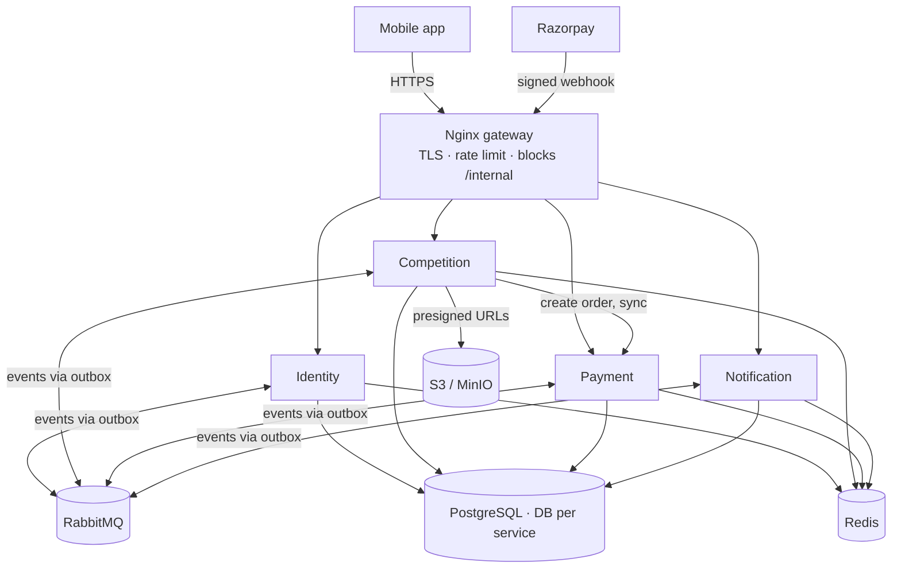

# Feedants — Project Plan

| | |
|---|---|
| **Status** | Approved — 2026-09-27 |
| **Current phase** | Phase 1 — Design (in progress; see [docs/02-design/](02-design/)) |
| **Product context** | [design/prototype/docs/AboutProject.md](../design/prototype/docs/AboutProject.md) |

## Goal

Rebuild the Feedants Figma prototype (28 screens, mock data, no backend) as a real, deployed product: a mobile app backed by a small event-driven microservice system. The project is deliberately **architecturally complete but functionally narrow** — every structural concern (services, security, observability, CI/CD, infrastructure as code) exists from the start, while features are limited to the core marketplace loop. Later features are added as new endpoints and events, not redesigns.

## Principles

1. **Architecture complete, features minimal.** All services, pipelines, security and monitoring exist in the MVP; each service carries only its core features.
2. **Every tool earns its place.** If a tool's purpose cannot be stated in one sentence, it is not in the stack.
3. **Twelve-factor.** Config from the environment, stateless processes, logs to stdout, dev/prod parity.
4. **Scale by configuration, not rewrite.** Containerised, stateless services with their own data, talking through events. Moving from one server to many is a Terraform change.
5. **Everything in git.** Code, infrastructure, docs, diagrams and decisions.

## Approved decisions

| Area | Decision | Rationale (full ADRs in Phase 1) |
|---|---|---|
| Architecture | Lightweight microservices: 4 services + gateway | Hands-on with service boundaries, async messaging and distributed consistency, without heavy platform tooling |
| Backend | Node.js 24 LTS + NestJS, one language for all services | Shared types and validation with the mobile app; structured framework |
| Mobile | Expo (React Native), Android + web export | Real mobile app; web export gives a clickable demo link |
| Messaging | RabbitMQ | Retries and dead-letter queues out of the box; one lightweight container. Kafka only if replay or very high throughput is needed |
| Database | PostgreSQL, one database per service on one instance, separate DB user per service | Ownership enforced by permissions without the cost of multiple servers |
| Auth | Email OTP, RS256 JWT + JWKS, rotating refresh tokens | Free to run; services verify tokens without calling Identity |
| Cloud | AWS, single EC2 host via Terraform, Docker Compose | Industry-standard IaC; always-on and cheap; stopped when not demoing |
| Prize funding | Simulated escrow recorded in the ledger (test mode) | Demonstrates ledger design without handling real money |
| Repository | Public GitHub monorepo (pnpm workspaces + Turborepo) | Free SonarQube Cloud and CodeQL; readable by recruiters |

**Explicitly not used:** Kubernetes, service mesh, Kafka, service discovery servers (Eureka/Consul), a database server per service, gRPC, GraphQL federation, event sourcing (except the naturally append-only ledger), multiple languages.

## Architecture



| Service | Owns | Why separate |
|---|---|---|
| **Identity** | Users, profiles, OTP, tokens | Every service depends on it; it signs the tokens others verify |
| **Competition** | Competitions, spots, registrations, submissions, judging, leaderboard, search | Core domain. Registrations and submissions stay together because they need one local transaction |
| **Payment** | Orders, webhooks, ledger, refunds, payouts | Money isolated for security and correctness |
| **Notification** | In-app notifications, later push and realtime | Pure event consumer; its outage never blocks the core loop |

**Communication rule:** events by default; a synchronous call only when an immediate answer is needed (e.g. Competition asking Payment to create an order). Every synchronous call has a timeout.

**Consistency patterns (mandatory):**

- **Transactional outbox** — events are written to an `outbox` table in the same transaction as the data change, then relayed to RabbitMQ.
- **Idempotent consumers** — every handler records processed event IDs and ignores duplicates.
- **Saga for join & pay** — spot hold → order → signed webhook → `payment.captured` → registration confirmed; failure paths release the spot or refund a late payment.
- **Local copies of other services' data** (e.g. host display name), updated from events, so reads never fan out across services.

## Scope

### MVP

| Area | Included |
|---|---|
| Identity | Email OTP login, token refresh, profile view/edit |
| Competition | Host wizard (Basics → Prize → Schedule → Review), publish, list/filter/search, detail, join with spot hold, media upload via presigned URL, host scoring, results, leaderboard |
| Payment | Entry-fee orders, verified webhooks, double-entry ledger, automatic refunds, winner credits, wallet balance view |
| Notification | In-app notifications and unread count |
| Mobile (~14 screens) | Splash, login, verify, home, explore/search, competition detail, join sheet, host wizard, my submissions, my competitions (judging), leaderboard, notifications, wallet, profile |

### Later

Phone OTP, referrals, push notifications, realtime Live screen (WebSocket), chat, withdrawals and payouts, external judges, Hindi localisation, OpenSearch.

### Out of scope

Real video streaming, KYC, GST invoicing, real-money operation. Paid-entry contests with cash prizes may fall under India's 2025 online gaming regulation; the system runs in **test mode only**.

## Tooling

| Area | Tools |
|---|---|
| Planning & design | GitHub Projects + Issues, Figma (existing), Mermaid, Excalidraw |
| Mobile | Expo, Expo Router, TypeScript strict, NativeWind, TanStack Query, Zustand, react-hook-form + zod, FlashList, expo-image, expo-secure-store, i18next |
| Backend | NestJS, Prisma, nestjs-zod, @nestjs/config, @nestjs/terminus, @nestjs/swagger, @nestjs/throttler, @golevelup/nestjs-rabbitmq, jose, Helmet, nestjs-pino |
| Data & messaging | PostgreSQL, Redis, RabbitMQ, S3 (MinIO locally), Mailpit locally / SES or Resend in production, Razorpay test mode, cloudflared for local webhooks |
| DevOps | Docker + Compose, Nginx, Terraform, AWS (VPC, EC2, S3, IAM, SSM Parameter Store, Session Manager, Budgets), GitHub Actions, GHCR, Let's Encrypt, Expo EAS |
| Quality | pnpm workspaces + Turborepo, ESLint + Prettier, husky + lint-staged + commitlint, Jest + Supertest, Testcontainers, Maestro, k6, Bruno, SonarQube Cloud |
| Security | gitleaks, Dependabot, CodeQL, Trivy, OWASP ZAP (Phase 4) |
| Observability | OpenTelemetry, Jaeger (local), Prometheus + Grafana (local, optional), Grafana Cloud (production), Sentry, UptimeRobot |
| Documentation | Markdown + Mermaid, C4 model, OpenAPI (generated), AsyncAPI, MADR-style ADRs, release-please |

**Later, only when a measured signal requires it:** RDS, ElastiCache, CloudFront, ECS Fargate, PgBouncer, OpenSearch, Kafka.

## SDLC phases

Planning and design happen once up front. Build, test and deploy then repeat in one-week sprints. Operations continue after launch.

```text
Phase 0 Plan ─► Phase 1 Design ─► Phase 2 Foundation ─► [ weekly sprint loop: plan → build → test → review → deploy → retro ] ─► Phase 6 Operate
```

| Phase | Weeks | Activities | Deliverables | Exit criteria |
|---|---|---|---|---|
| **0 — Planning** | 1 | SRS from product context, user stories with acceptance criteria, MoSCoW prioritisation, assumptions, risks, task board | `SRS.md`, `USER_STORIES.md`, `SCOPE.md`, `ASSUMPTIONS.md`, `RISKS.md` | Every MVP story has acceptance criteria and priority |
| **1 — Design** | 1–2 | C4 architecture, per-service LLD and state machines, ERDs, OpenAPI and AsyncAPI contracts, STRIDE threat model, UI tokens, first ADRs | `HLD.md`, `LLD/*.md`, `ERD.md`, `openapi/*`, `asyncapi.yaml`, `THREAT_MODEL.md`, `adr/*` | Join & pay flow, including every failure path, can be walked through on paper |
| **2 — Foundation** | 2 | Monorepo, shared package, Compose stack, CI with quality gates, commit hooks, branch protection, hello-world services behind Nginx | `LOCAL_SETUP.md`, `CONTRIBUTING.md`, `CODING_STANDARDS.md`, `GIT_WORKFLOW.md` | Clone → install → `docker compose up` works in 10 minutes; CI green |
| **3 — Sprints** | 3–9 | See sprint table below | Working increments, demo recordings, retros | Sprint demo passes |
| **4 — Hardening** | 10 | End-to-end tests, k6 load test, OWASP ZAP, resilience tests, UAT, accessibility check | `TEST_STRATEGY.md`, `TEST_REPORT.md`, `SECURITY_REVIEW.md` | Performance targets met; no high-severity findings |
| **5 — Deployment** | 11 | Terraform AWS, domain + TLS, secrets in SSM, pipeline deploy, nightly backups with a restore drill, monitoring and alerts, v1.0.0 | `DEPLOYMENT.md`, `INFRASTRUCTURE.md`, `RELEASE_PROCESS.md`, `CHANGELOG.md` | Public demo URL and APK; restore drill succeeded |
| **6 — Operations** | 12+ | SLOs and alerts, runbooks, incident drill with post-mortem, cost tracking, dependency updates | `SLO.md`, `runbooks/*`, `postmortems/*`, `DEBUGGING_LOG.md` | One full incident drill documented |

### Sprint plan

| Sprint | Goal | Demo |
|---|---|---|
| S1 | Identity service, app login, token refresh | Log in on a phone |
| S2 | Competition service: host wizard, publish, list, detail, search | Home and Explore show real data |
| S3 | Payment service, join & pay saga, spot holds | Pay ₹99 in test mode → "You're in!" |
| S4 | Failure paths: late payment refund, hold expiry, duplicate webhooks | Each failure path covered by a test |
| S5 | Presigned uploads, submissions, judging, results, leaderboard | One full contest end to end |
| S6 | Notification service, wallet view, winner credits | Notifications arrive; wallet shows prize |
| S7 | Caching, tracing, security hardening, performance targets | Jaeger trace and k6 numbers |

## Environments and delivery

| Environment | Where | Purpose |
|---|---|---|
| Local | Laptop — infrastructure in Docker, services via `pnpm dev` | Fast development with hot reload |
| CI | GitHub Actions with throwaway containers | Automated checks on every PR |
| Staging (on demand) | `terraform workspace` → apply → test → destroy | Proves the infrastructure is reproducible, for cents |
| Production | Single EC2 host running Docker Compose | Live demo |

**CI (every PR, affected packages only):** install → lint → typecheck → unit → integration (Testcontainers) → event contract tests → build → gitleaks → CodeQL → Trivy → SonarQube gate.

**CD (every merge to `main`):** build images tagged with the commit SHA → push to GHCR → Trivy scan → backward-compatible migrations → deploy via SSM one service at a time → smoke test → automatic rollback to the previous tag on failure.

**Mobile:** release tag → EAS Build (APK); JavaScript-only fixes ship with EAS Update.

**Database migrations** follow expand → migrate → contract, so the running version never breaks during a deploy.

**Git workflow:** trunk-based; short-lived `feat/*` and `fix/*` branches; Conventional Commits; protected `main` requiring a PR and green CI; release-please generates versions and the changelog.

## Security

- **Network:** only Nginx is public (80/443). SSH is closed; access is via AWS SSM Session Manager. Services and data stores sit on internal Docker networks; Postgres, Redis and RabbitMQ publish no ports. S3 bucket is private and accessed only through short-lived presigned URLs.
- **Gateway:** TLS, per-IP rate limits (stricter on OTP and login), request size limits, security headers, `/internal/*` blocked from the internet.
- **Application:** RS256 JWT verified locally via JWKS; refresh token rotation with reuse detection; ownership checks on every resource (OWASP API #1, BOLA); zod validation rejecting unknown fields; Helmet and strict CORS; least-privilege DB user per service; webhook HMAC verification on the raw body; audit log for money actions; non-root containers; PII and secrets redacted from logs.
- **Supply chain:** gitleaks, Dependabot, CodeQL, Trivy on images and Terraform.

## No hard-coded values

| Kind | Lives in | Enforcement |
|---|---|---|
| Environment config | Env vars → `@nestjs/config` | zod-validated at startup; `.env.example` committed, `.env` never |
| Secrets | Local `.env`; AWS SSM Parameter Store (SecureString) in production | gitleaks pre-commit and in CI |
| Business rules (hold TTL, fee, OTP expiry, upload limits) | Typed config per service | No magic numbers in code review |
| Reference data (categories) | Database table | Adding one needs no deploy |
| Mobile (API URL, colors, copy) | EAS env config, design tokens, i18n files | No literal colors or user-facing strings in components |
| Infrastructure (region, instance size, AMI) | Terraform variables and `.tfvars`; AMI via data lookup | `terraform validate` + Trivy in CI |

## Caching

| What | Where | Invalidation |
|---|---|---|
| Home sections, competition detail | Redis, cache-aside | 60 s TTL with jitter, plus eviction on `competition.updated` |
| Leaderboard | Redis sorted set | Rebuilt from Postgres if lost |
| Rate-limit counters, OTP codes | Redis | TTL |
| JWKS public key | In-process memory | Periodic refresh |
| Client data | TanStack Query | Per-screen stale time |
| **Never cached** | Spots remaining at join, wallet balance, payment status | Always read from Postgres |

Stampede protection: a short single-flight lock on rebuild and TTL jitter.

## Observability and debugging

- Structured JSON logs with `service`, `requestId`, `userId`, `traceId`.
- OpenTelemetry traces propagated through HTTP headers **and RabbitMQ message headers**, viewed in Jaeger.
- `/health/live` and `/health/ready` (readiness checks Postgres, Redis, RabbitMQ).
- Sentry on the app and every service; UptimeRobot for uptime.
- Dead-letter queue per consumer with an inspect-and-replay script.
- Swagger per service, Bruno collection, seed script, VS Code debugger attach.
- `docs/05-operations/DEBUGGING_LOG.md`: each real bug recorded as symptom → cause → fix → prevention.

## Performance targets

| Area | Target | Approach |
|---|---|---|
| API reads | p95 < 200 ms | Indexes, `EXPLAIN ANALYZE`, Redis cache, no N+1 |
| API writes | p95 < 400 ms | Short transactions; slow work via RabbitMQ |
| Lists | Constant cost per page | Cursor pagination, never `OFFSET` |
| DB connections | No exhaustion | Fixed pool per service (PgBouncer later) |
| Network | Small payloads | gzip + keep-alive at Nginx, `ETag` on public reads |
| Uploads | Fast on mobile data | Client-side compression, direct-to-S3 |
| App start | < 2 s | Lazy routes, image caching, virtualised lists |
| Docker images | < 200 MB each | Multi-stage builds, production dependencies only |

## Scaling path

Each step is triggered by a measured signal, not a guess. The detailed version will live in `docs/02-design/SCALING.md`.

| Stage | Signal | Change | Code impact |
|---|---|---|---|
| MVP | — | 1 EC2 host, Compose | — |
| ~100k users | DB CPU > 60 % or managed backups needed | RDS, ElastiCache, CloudFront | Config only |
| More traffic | App CPU > 70 % | Load balancer + 2+ EC2 hosts | None — services are stateless |
| ~1M users | Services need independent scaling | ECS Fargate autoscaling, PgBouncer, read replicas | Terraform only |
| Slow search | Search p95 > 300 ms | OpenSearch fed by `competition.*` events | New consumer |
| Event volume | Replay needed or > 10k events/s | Kafka behind the shared messaging package | Messaging package only |
| Competition service too large | Divergent change or scale | Extract media/submissions service | Planned, contained |

## Definition of Done

- [ ] Acceptance criteria met
- [ ] Unit and integration tests written; CI green
- [ ] No hard-coded config or secrets
- [ ] Input validated, authorisation (including ownership) checked, standard error format
- [ ] Logs carry request ID; new endpoints traced
- [ ] OpenAPI / AsyncAPI updated; ADR written if a decision was made
- [ ] Deployed and smoke-tested

## Roles practised

| Role | Activities | Evidence |
|---|---|---|
| Business analyst / product | Requirements, user stories, scope | SRS, backlog, `SCOPE.md` |
| Architect | Service boundaries, patterns, trade-offs | HLD, C4 diagrams, ADRs |
| Backend developer | Services, data model, APIs, saga | Code, OpenAPI |
| Mobile developer | Expo app matching the design | APK, demo video |
| QA / SDET | Test strategy, Testcontainers, Maestro, k6 | Test report with numbers |
| DevOps | Docker, Nginx, Terraform, CI/CD | Pipelines, Terraform code |
| SRE | SLOs, tracing, runbooks, incident drills | Dashboards, post-mortems |
| Security | Threat model, scanning, network isolation, secrets | Threat model, scan reports |
| Technical writer | `docs/` | The documentation set |
| Release manager | Versioning, changelog, rollback | GitHub releases |

## Timeline and cost

About 12 weeks part-time (see the SDLC table). Running cost: roughly $15/month for EC2 while running (stopped when not demoing), a domain at about ₹800/year, free tiers elsewhere. An AWS budget alarm is created by Terraform.

## Prototype issues not to carry over

| Prototype behaviour | Problem | Rebuild approach |
|---|---|---|
| `prize: '₹ 1,500'`, `endsIn: '1d : 06h'` stored as strings | Cannot sort, sum or validate; countdown never changes | Money as integer paise; UTC timestamps; countdown computed on device |
| `getCompetition(id)` falls back to the first competition | Bad links silently show the wrong contest | 404 |
| 1,000–1,500-line page components | Hard to test and review | Small components and hooks per screen |
| Unknown routes render `ComingSoon`, not `ErrorScreen` | Inconsistent error handling | One error path |
| External avatar URLs that fail to load | Broken images | Own storage plus fallback |
| ENG/हिंदी toggle renders tofu | Devanagari font subset not loaded | i18n from day one; load Devanagari subset when Hindi ships |
| Full-page screenshots show the Create sheet mid-page | Capture artifact of fixed elements | Viewport-sized captures for visual comparison |
